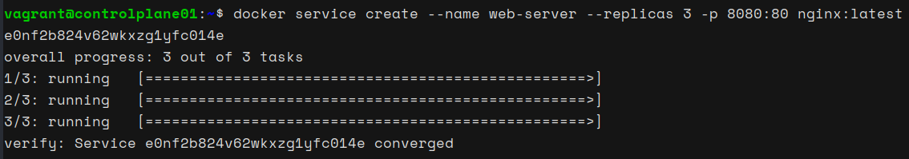
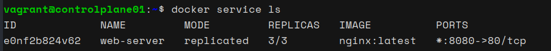
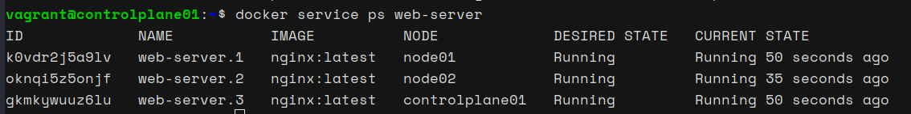

# Launching an NGINX Service on Docker Swarm

In this part of the guide, we will create a Docker Swarm service called `web-server` using the latest NGINX image, with three replicas distributed across our Swarm cluster nodes.

### Step 1: Create NGINX Service with Replicas

1. **SSH into the control plane node (`controlplane01`).**

2. **Create a service called `web-server` with three replicas of the latest NGINX image:**

   ```bash
   docker service create --name web-server --replicas 3 -p 8080:80 nginx:latest
   ```

   

### Step 2: Verify Service and Replicas

1. **List the created service:**

   ```bash
   docker service ls
   ```
   

   This command will display the service ID, name, mode (replicated), number of replicas, image (nginx:latest), and port mapping information.

2. **Inspect the tasks of the service to see where each replica is running:**

   ```bash
   docker service ps web-server
   ```

   

   We will see three tasks: `web-server.1`, `web-server.2`, and `web-server.3`, each running on different nodes.

### Step 3: Test the NGINX Web Server

1. **Access the NGINX default web page on each node:**

   - For `controlplane01` (manager):
     ```bash
     http://<controlplane_IP>:8080
     ```

   - For `node01` (worker):
     ```bash
     http://<node01_IP>:8080
     ```

   - For `node02` (worker):
     ```bash
     http://<node02_IP>:8080
     ```

   Replace `<controlplane_IP>`, `<node01_IP>`, and `<node02_IP>` with the respective IP addresses of your nodes.

### Conclusion

Docker Swarm has successfully deployed the NGINX web server service across the cluster with three replicas, ensuring high availability and load distribution. Each node is running one instance of the NGINX web server, accessible on port 8080. This setup demonstrates the power and flexibility of Docker Swarm in managing containerized applications across multiple nodes.
