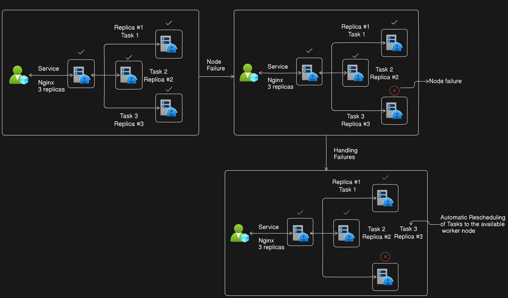

# Docker Swarm: Handling Failures and Ensuring High Availability

## Introduction
Docker Swarm is a container orchestration tool that simplifies the deployment, scaling, and management of containerized applications across a cluster of Docker hosts. One of the key features of Docker Swarm is its ability to handle failures gracefully and ensure high availability of applications.

## Handling Failures
Docker Swarm employs several mechanisms to handle failures:

### Automatic Rescheduling of Tasks
- When a node in the Swarm cluster fails, Docker Swarm automatically detects the failure and redistributes any tasks running on that node to healthy nodes in the cluster.
- This ensures that applications continue to run seamlessly without interruption, even in the event of node failures.

### Node Promotion
- If the manager node (leader) of the Swarm cluster goes down, Docker Swarm initiates a mutual election process among the remaining worker nodes to select a new leader.
- One of the healthy worker nodes is promoted to the manager role, ensuring continuity of management and coordination within the Swarm cluster.

### Maintaining Quorum
- Docker Swarm requires a majority of nodes (quorum) to be operational to ensure proper functioning of the cluster. 
- If the number of working nodes falls below the quorum, the Swarm cluster may become unavailable until additional nodes are brought online or the existing nodes are recovered.

## Ensuring High Availability
By automatically rescheduling tasks, promoting new manager nodes, and maintaining quorum, Docker Swarm ensures high availability of containerized applications:

- **Continuous Operation**: Containerized applications remain available and operational, even in the face of node failures or disruptions.
- **Seamless Recovery**: Failures are handled automatically by Docker Swarm, minimizing downtime and ensuring continuous service availability.
- **Scalability**: Docker Swarm enables automatic scaling of applications based on demand, ensuring that resources are allocated dynamically to handle fluctuations in traffic.

## Conclusion
Docker Swarm provides robust mechanisms for handling failures and ensuring high availability of containerized applications. By leveraging these features, organizations can deploy and operate containerized applications with confidence, knowing that Docker Swarm will maintain service availability and reliability, even in challenging environments.