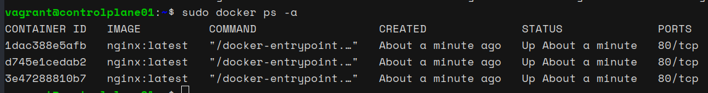
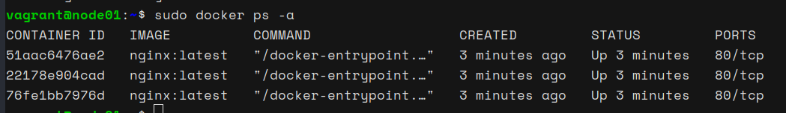

# Scaling and Updating Docker Services in a Swarm Cluster

In this guide, we will perform a few more orchestration-related tasks using Docker Swarm. We will scale our existing service `web-server`, update the service to use a different image, and then clean up the cluster by removing the service and making a worker node leave the cluster.

#### 1. Scaling the Service

First, let's scale our `web-server` service to increase its number of replicas from 3 to 6.

```bash
sudo docker service scale web-server=6
```

#### 2. Verifying the Scaling

After scaling the service, we can verify it by listing the tasks for the service:

```bash
sudo docker service ps web-server
```

We should now see 6 containers running.

#### 3. Listing Containers on Each Node

To confirm the distribution of containers, run:

**On `controlplane01`:**

```bash
sudo docker ps -a
```


**On `node01`:**

```bash
sudo docker ps -a
```



Each node should have 3 containers running.

#### 4. Updating the Service Image

Let's update the service to use the `nginx:alpine` image instead of `nginx:latest`.

```bash
sudo docker service update --image nginx:alpine web-server
```

#### 5. Verifying the Update

We can verify the update process and ensure all tasks are using the new image:

```bash
sudo docker service inspect --pretty web-server
```

Check the container specification to confirm it shows `nginx:alpine`.

#### 6. Removing the Service

After verifying the update, we can remove the service:

```bash
sudo docker service rm web-server
```

We can verify that the service has been removed and all containers have been taken down:

**On `controlplane01`:**

```bash
sudo docker ps -a
```

**On `node01`:**

```bash
sudo docker ps -a
```

#### 7. Cleaning Up the Cluster

Finally, let's make `node01` leave the cluster:

**On `node01`:**

```bash
sudo docker swarm leave
```

After `node01` leaves, we can verify the nodes in the cluster:

**On `controlplane01`:**

```bash
sudo docker node ls
```

We should see that only `controlplane01` remains in the cluster.

By following these steps, we can effectively scale, update, and manage services within a Docker Swarm cluster, ensuring smooth operations and easy maintenance.