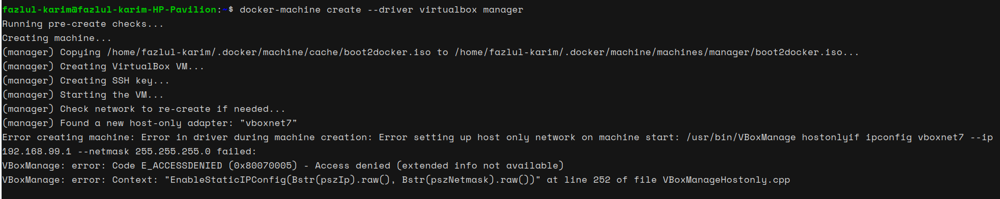

# Issues encountered during the creation of VirtualBox Manager with Docker Machine

**Problem Description:**
Encountered issues while attempting to create a VirtualBox manager using Docker Machine. The main issue was related to configuring the host-only network interface in VirtualBox, resulting in an `E_ACCESSDENIED` error.

**Solutions Attempted:**

1. **Run VirtualBox with Elevated Privileges:**
   - Executed VirtualBox and Docker Machine commands with elevated permissions to ensure administrative privileges for configuring network settings.

2. **Ensure User is in the vboxusers Group:**
   - Added the user to the `vboxusers` group to grant necessary permissions for managing VirtualBox VMs.

3. **Manually Create and Configure the Host-Only Network:**
   - Attempted to manually create and configure the host-only network interface using `VBoxManage` commands. Created a new interface and configured its IP address and netmask, but encountered the access denied error during this process.

