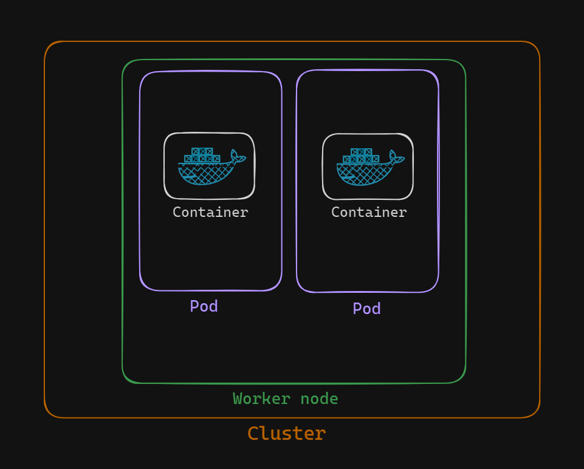

# Understanding Kubernetes Pods

In Kubernetes, Pods are a fundamental concept and the smallest deployable units that can be created and managed. To truly understand Kubernetes, it's crucial to understand Pods. This documentation will explain what Pods are, their significance, and key characteristics.

## What are Pods?

In the context of a traditional Docker setup, containers run on top of Docker. Kubernetes, however, adds an additional layer by encapsulating containers within an object called a Pod. This encapsulation is essential for Kubernetes to manage containers effectively.

    

### Key Points about Pods:
1. **Encapsulation**: Kubernetes does not directly manage containers; instead, it encapsulates them within Pods. 
2. **Structure**: A Pod can contain one or more containers. However, it is common practice to have a single container per Pod.
3. **Workload Objects**: Pods fall under the category of workload objects in Kubernetes, meaning they are the smallest unit of orchestration.
4. **Interaction**: The only way to interact with containers in Kubernetes is through Pods, making them a crucial part of the architecture.

## Characteristics of Pods

### The Smallest Unit of Orchestration
- **Fundamental Unit**: Everything in Kubernetes revolves around Pods. They are the building blocks for application deployment in a Kubernetes cluster.
- **Atomic Unit**: All Kubernetes operations are performed on Pods, making them the atomic unit of orchestration.

### Container Management
- **Single or Multiple Containers**: Each Pod runs at least one container. It is possible to run multiple containers within a single Pod, although the common practice is to have one container per Pod.
- **Shared Resources**: Containers within a Pod share the same network namespace, IP address, and storage volumes, allowing for easy inter-container communication.

### Lifecycle Management
- **Designed for Failure**: Kubernetes is built with the understanding that containers can fail. Pods are designed to handle container failures gracefully.
- **Restart Policy**: By default, the restart policy for containers within Pods is set to "always." This ensures that containers are restarted automatically if they fail, providing resilience and high availability.

### Higher-Level Orchestration
- **Orchestration on Pods**: Higher-level Kubernetes objects and controllers, such as Deployments, StatefulSets, and DaemonSets, perform orchestration on Pods. This abstraction simplifies management and scaling of containerized applications.

## Working with Pods

Understanding Pods is essential for effectively using Kubernetes. As we begin to work with Kubernetes, we should remember these key points about Pods:
- They are the smallest unit of deployment and management.
- Each Pod encapsulates one or more containers.
- Pods provide a resilient and self-healing mechanism for managing container failures.
- Higher-level Kubernetes objects orchestrate Pods, simplifying container management at scale.

With this foundational knowledge of Pods, we are ready to begin working with them in Kubernetes environment.