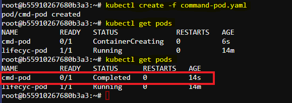
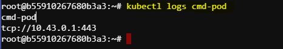

# Demonstration of Changing Container Command in Kubernetes Pod

This documentation outlines the process of changing the entrypoint command of a container within a Kubernetes Pod. We'll use a sample YAML file `command-pod.yaml` and explore how to create and verify a Pod with a custom command.

## Steps

### 1. List Existing Pods

First, list the available Pods to see the current state of your cluster:

```sh
kubectl get pods
```

- We should see only the `lifecyc-pod` from the previous document.

### 2. Create a New Pod with Custom Command

We will use a YAML file named `command-pod.yaml` to create a new Pod with a custom entrypoint command. Here’s the content of `command-pod.yaml`:

```yaml
apiVersion: v1
kind: Pod
metadata:
  name: cmd-pod
spec:
  containers:
  - name: cmd-container
    image: nginx
    command: [ "printenv" ]
    args: [ "HOSTNAME", "KUBERNETES_PORT" ]
```

### 3. Understanding the YAML File

- **Pod and Container Names**:
  - Pod: `cmd-pod`
  - Container: `cmd-container`
- **Image**: Using the nginx image.
- **Command**: The entrypoint command for the container is set to `printenv`.
- **Arguments**: The arguments for the command are `HOSTNAME` and `KUBERNETES_PORT`.

### 4. Create the Pod

To create the Pod, run the following command:

```sh
kubectl create -f command-pod.yaml
```

### 5. Verify Pod Creation

List the Pods to ensure `cmd-pod` is created:

```sh
kubectl get pods
```

- The `cmd-pod` should appear in the list. Note that it may be in the `Completed` state because the custom command finishes execution quickly.



### 6. Describe the Pod

To get a detailed description of the Pod, use:

```sh
kubectl describe pod cmd-pod
```

- Focus on the `Command` and `Arguments` sections to see the provided values.
- In the `Events` section, note the timestamps indicating when the container started and completed its tasks.

### 7. Check Pod Logs

To view the output of the executed command, use:

```sh
kubectl logs cmd-pod
```

- The log output should show the values of `HOSTNAME` and `KUBERNETES_PORT`, confirming that the custom command ran successfully.



## Summary

In this demonstration, we modified the entrypoint command of a container in a Kubernetes Pod using a YAML configuration file. The `command-pod.yaml` file specified a custom command (`printenv`) and its arguments (`HOSTNAME`, `KUBERNETES_PORT`). We created the Pod, verified its creation, and checked the logs to confirm that the custom command executed successfully. This approach can be useful for running specific initialization tasks or custom scripts within containers.
