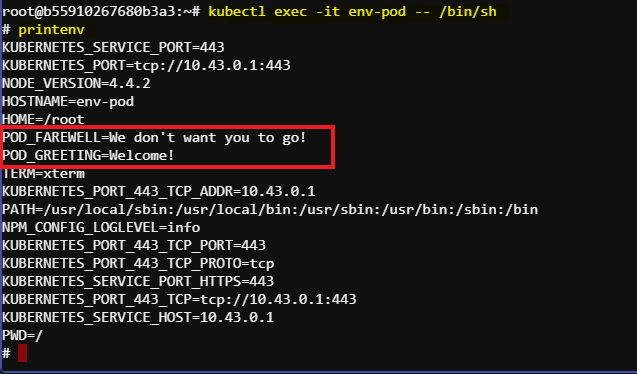

# Demonstration of Setting Environment Variables in Kubernetes Pods

This documentation provides a detailed walkthrough of how to set environment variables in a Kubernetes Pod. We will use a YAML file named `environment-pod.yaml` and demonstrate the steps to create and verify a Pod with custom environment variables.

## Steps

### 1. List Existing Pods

First, list the available Pods to see the current state of our cluster:

```sh
kubectl get pods
```

- You should see two Pods: `cmd-pod` (completed) and `lifecyc-pod` (running).

### 2. Create a New Pod with Environment Variables

We will use a YAML file named `environment-pod.yaml` to create a new Pod with custom environment variables. Here’s the content of `environment-pod.yaml`:

```yaml
apiVersion: v1
kind: Pod
metadata:
  name: env-pod
spec:
  containers:
  - name: env-container
    image: gcr.io/google-samples/node-hello:1.0
    env:
    - name: POD_GREETING
      value: "Welcome!"
    - name: POD_FAREWELL
      value: "We don't want you to go!"
```

### 3. Understanding the YAML File

- **Pod and Container Names**:
  - Pod: `env-pod`
  - Container: `env-container`
- **Image**: We use the full path to the image hosted on Google Container Registry: `gcr.io/google-samples/node-hello:1.0`.
- **Environment Variables**: 
  - `POD_GREETING`: Set to "Welcome!"
  - `POD_FAREWELL`: Set to "We don't want you to go!"

### 4. Create the Pod

To create the Pod, run the following command:

```sh
kubectl create -f environment-pod.yaml
```

### 5. Verify Pod Creation

List the Pods to ensure `env-pod` is created:

```sh
kubectl get pods
```

- The `env-pod` should appear in the list and should be in the `Running` state.

### 6. Describe the Pod

To get a detailed description of the Pod, use:

```sh
kubectl describe pod env-pod
```

- Navigate to the `Environment` section to see the custom environment variables (`POD_GREETING` and `POD_FAREWELL`).

### 7. Execute a Command Inside the Pod

To interact with the Pod and verify the environment variables, use:

```sh
kubectl exec -it env-pod -- /bin/sh
```

- We are now in the root directory of the container. To print the environment variables, run:

```sh
printenv
```

- We should see a list of environment variables including `POD_GREETING` and `POD_FAREWELL` with their respective values.



### 8. Exit the Container

Once we have verified the environment variables, exit the container:

```sh
exit
```

## Summary

In this demonstration, we modified the environment variables of a container in a Kubernetes Pod using a YAML configuration file. The `environment-pod.yaml` file specified two custom environment variables (`POD_GREETING` and `POD_FAREWELL`). We created the Pod, verified its creation, and checked the environment variables within the running container.
