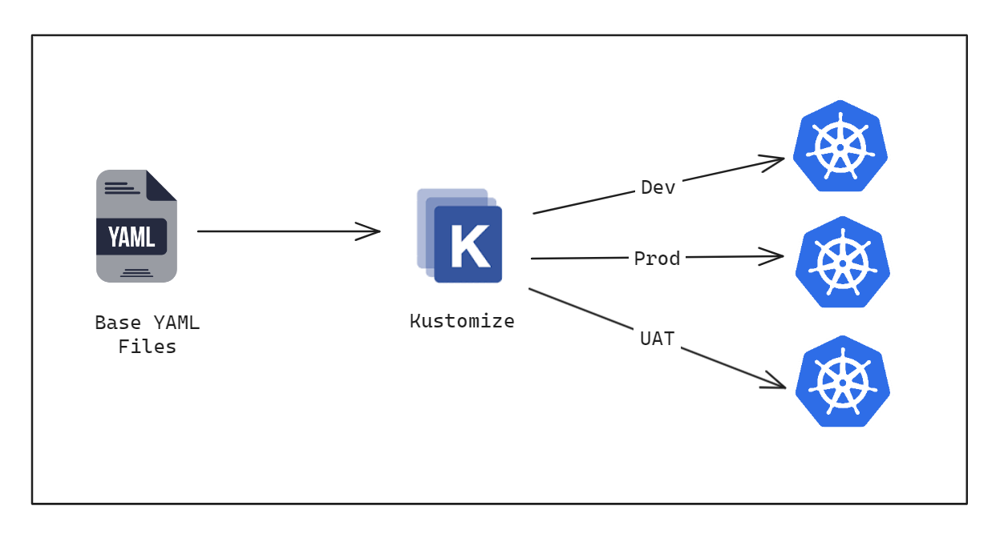

# Kustomize: Simplifying Kubernetes Configurations for Multiple Environments



## What is Kustomize?

Kustomize is a tool that helps you manage Kubernetes configurations more easily. Think of it as a way to customize your Kubernetes YAML files without actually changing the original files.

In simple terms, Kustomize allows you to:
- Define a basic set of Kubernetes resources (like deployments, services, etc.)
- Create variations of these resources for different environments or use cases
- Do all this without duplicating or modifying your original configuration files

## Why Use Kustomize?

Imagine you're deploying an application to Kubernetes, and you need slightly different configurations for development, testing, and production environments. Without Kustomize, you might end up with three nearly identical sets of YAML files, with small changes for each environment. This can become hard to manage as your application grows.

Kustomize solves this problem by allowing you to:
- Keep one base configuration
- Define only the differences for each environment
- Automatically generate the full configuration for each environment when you need it

This approach reduces duplication, makes your configurations easier to understand and maintain, and lessens the chance of errors when updating your configurations.

## Use Cases for Kustomize

Here are some common scenarios where Kustomize shines:

1. **Multi-Environment Deployments**: 
   - You have one application that needs to run in development, staging, and production environments.
   - Each environment needs slightly different configurations (e.g., number of replicas, resource limits).

2. **Feature Flags**:
   - You want to enable or disable certain features of your application in different deployments.
   - Kustomize can help you manage these variations without maintaining separate complete configurations.

3. **Configuration Management**:
   - You need to manage environment variables, ConfigMaps, or Secrets across different environments.
   - Kustomize allows you to define these once and customize as needed for each environment.

4. **Resource Customization**:
   - You want to add specific labels, annotations, or prefixes to your Kubernetes resources based on the environment.
   - Kustomize can apply these customizations automatically.

## Installing Kustomize

Kustomize is already integrated into kubectl (version 1.14 and later), but you can also install it as a standalone tool. Here's how:

### Using kubectl

If you're using a recent version of kubectl, you already have Kustomize! You can use it with commands like:

```bash
kubectl apply -k ./my-kustomization-directory
```

### Standalone Installation

For the standalone version, follow these steps:

1. **Download the binary:**

   ```bash
   curl -s "https://raw.githubusercontent.com/kubernetes-sigs/kustomize/master/hack/install_kustomize.sh" | bash
   ```

2. **Move the binary to your PATH:**

   ```bash
   sudo mv kustomize /usr/local/bin/
   ```

3. **Verify the installation:**

   Run this command to check if Kustomize is installed correctly:
   ```bash
   kustomize version
   ```

   You should see the version number of Kustomize printed in your terminal.

   

## Next Steps

Now that you have Kustomize installed, you're ready to start learning how to use it! Here are some tasks we will do in the next labs:

1. Create a simple Kubernetes YAML file (like a Deployment) and try to customize it with Kustomize.
2. Learn about the `kustomization.yaml` file, which is the key to using Kustomize.
3. Experiment with overlays to create environment-specific configurations.

Remember, the best way to learn is by doing. Start with small examples and gradually build up to more complex configurations. Happy Kustomizing!