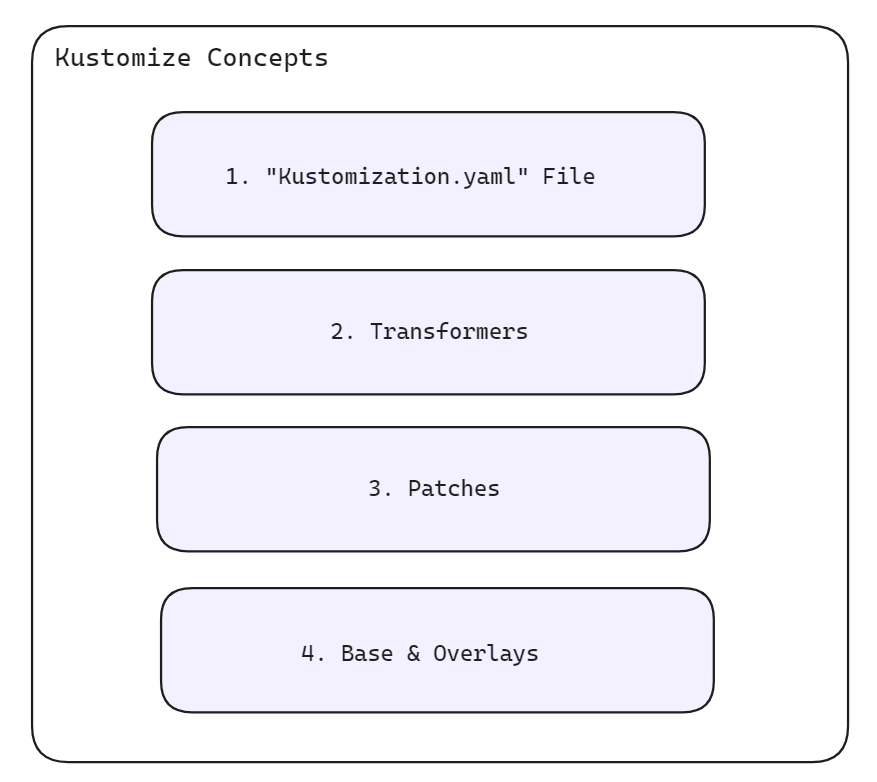
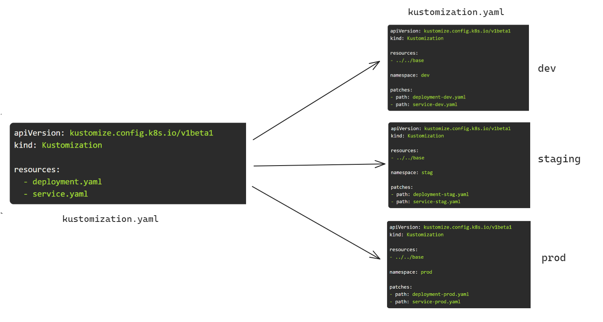
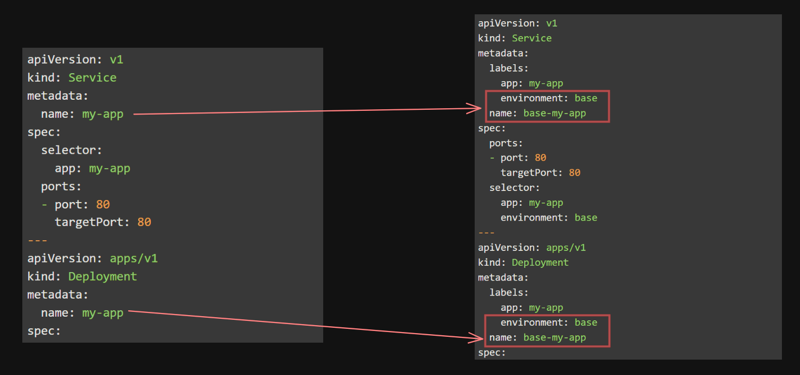
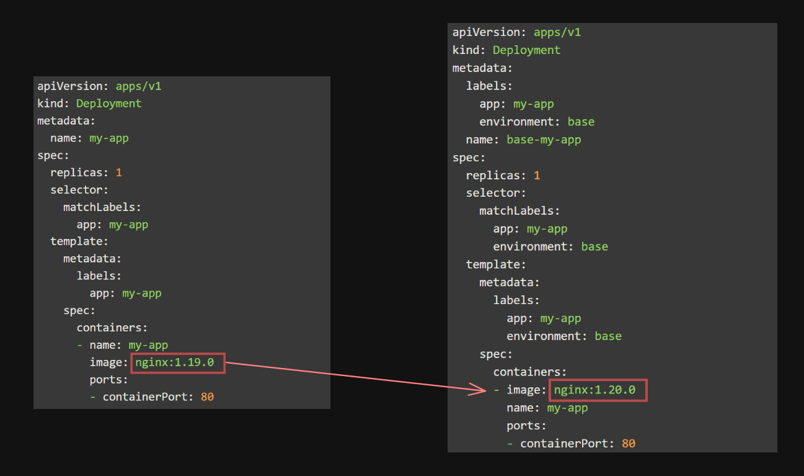
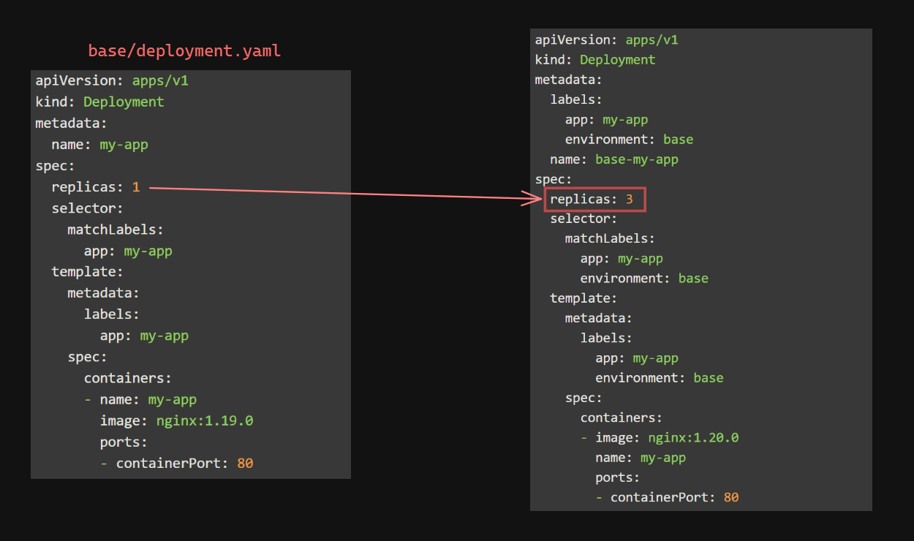

# Kustomize in Practice: Managing Kubernetes Configurations Across Environments

## Introduction

This guide walks through key Kustomize concepts using a shared base directory for the original YAML files. We'll cover how Kustomize modifies these base configurations and present the resulting YAML files.



## Project Structure

Let's start with the following project structure:

```
my-app/
├── base/
│   ├── deployment.yaml
│   ├── service.yaml
│   └── kustomization.yaml
└── overlays/
    ├── development/
        └── kustomization.yaml
```

## Base Configuration

The Base folder represents the config that will be identical across all the environments. We put all the Kubernetes manifests in the Base. It has a default value that we can overwrite.Let's define our base configurations.

### base/deployment.yaml

```yaml
apiVersion: apps/v1
kind: Deployment
metadata:
  name: my-app
spec:
  replicas: 1
  selector:
    matchLabels:
      app: my-app
  template:
    metadata:
      labels:
        app: my-app
    spec:
      containers:
      - name: my-app
        image: nginx:1.19.0
        ports:
        - containerPort: 80
```

### base/service.yaml

```yaml
apiVersion: v1
kind: Service
metadata:
  name: my-app
spec:
  selector:
    app: my-app
  ports:
  - port: 80
    targetPort: 80
```

### base/kustomization.yaml

The `kustomization.yaml` file is the heart of Kustomize operations. It defines the resources to be customized and the transformations to apply.

```yaml
apiVersion: kustomize.config.k8s.io/v1beta1
kind: Kustomization

resources:
  - deployment.yaml
  - service.yaml
```

This `kustomization.yaml` file defines the Kubernetes resources (`deployment.yaml` and `service.yaml`) that Kustomize will manage and customize.

## Kustomization Concepts

Now, let's explore different Kustomize concepts and the resulting YAML.

## 1. `kustomization.yaml` File

The `kustomization.yaml` file is the main file used by the Kustomize tool. When you execute Kustomize, it looks for the file named `kustomization.yaml`. This file contains a list of all the Kubernetes resources (YAML files) that should be managed by Kustomize. It also contains all the customizations we want to apply to generate the customized manifest.



Let's modify our base `kustomization.yaml`:

```yaml
apiVersion: kustomize.config.k8s.io/v1beta1
kind: Kustomization

resources:
  - deployment.yaml
  - service.yaml

commonLabels:
  app: my-app
  environment: base

namePrefix: base-
```

This `kustomization.yaml` file manages the `deployment.yaml` and `service.yaml` resources, applies common labels (`app: my-app`, `environment: base`) to all resources, and adds the prefix "base-" to their names.

Now, we can see the resulting YAML using:

```bash
kubectl kustomize ./base
```

Use this command if you are in the root directory. If you are in the directory where the `kustomization.yaml` file is located, then you can simply use:

```bash
kubectl kustomize .
```



Notice how the `commonLabels` and `namePrefix` have been applied to both resources.

## 2. Transformers

As the name indicates, transformers are something that transforms one config into another. Using Transformers, we can transform our base Kubernetes YAML configs. Kustomize has several built-in transformers. Let’s see some common transformers:

- **commonLabel** – It adds a label to all Kubernetes resources
- **namePrefix** – It adds a common prefix to all resource
names
- **nameSuffix** – It adds a common suffix to all resource
names
- **Namespace** – It adds a common namespace to all resources
- **commonAnnotations** – It adds an annotation to all resources

Let's use an image transformer to update the nginx version. Update `base/kustomization.yaml`:

```yaml
apiVersion: kustomize.config.k8s.io/v1beta1
kind: Kustomization

resources:
  - deployment.yaml
  - service.yaml

commonLabels:
  app: my-app
  environment: base

namePrefix: base-

images:
  - name: nginx
    newTag: 1.20.0
```

This `kustomization.yaml` file modifies the base configuration by adding a `commonLabels` section with the `app` and `environment` labels, prefixes resource names with "base-", and updates the `nginx` container image to version `1.20.0`.

Now, we can see the resulting YAML using:

```bash
kubectl kustomize ./base
```

Use this command if you are in the root directory. If you are in the directory where the `kustomization.yaml` file is located, then you can simply use:

```bash
kubectl kustomize .
```



The image version has been updated from 1.19.0 to 1.20.0.

## 3. Patches

Patches or overlays offer a flexible way to modify Kubernetes configurations by focusing on specific sections of the manifest. Three key parameters must be specified:

1. **Operation Type**: Defines the action to be performed—`add`, `remove`, or `replace`.
2. **Target**: Identifies the resource that needs modification.
3. **Value**: Specifies the new value to be added or replaced. For the `remove` operation, no value is required.

Let's apply a patch to increase the number of replicas. Create a new file `base/increase-replicas.yaml`:

```yaml
apiVersion: apps/v1
kind: Deployment
metadata:
  name: my-app
spec:
  replicas: 3
```

Update `base/kustomization.yaml`:

```yaml
apiVersion: kustomize.config.k8s.io/v1beta1
kind: Kustomization

resources:
  - deployment.yaml
  - service.yaml

commonLabels:
  app: my-app
  environment: base

namePrefix: base-

images:
  - name: nginx
    newTag: 1.20.0

patchesStrategicMerge:
  - increase-replicas.yaml
```

Now, we can see the resulting YAML using:

```bash
kubectl kustomize ./base
```

Use this command if you are in the root directory. If you are in the directory where the `kustomization.yaml` file is located, then you can simply use:

```bash
kubectl kustomize .
```



The number of replicas has been increased from 1 to 3.

## 4. Base & Overlays

The Base folder represents the config that will be identical across all the environments. We put all the Kubernetes manifests in the Base. It has a default value that we can overwrite.

On the other hand, the Overlays folder allows us to customize the behavior on a per-environment basis. We can create an Overlay for each environment. We specify all the properties and parameters that we want to overwrite and change.


Now, let's create environment-specific configurations using overlays.

#### overlays/development/kustomization.yaml

```yaml
apiVersion: kustomize.config.k8s.io/v1beta1
kind: Kustomization

resources:
  - ../../base

namePrefix: dev-
nameSuffix: -v1

commonLabels:
  environment: development

patches:
  - patch: |-
      - op: replace
        path: /spec/replicas
        value: 2
    target:
      kind: Deployment
      name: base-my-app
```

This `kustomization.yaml` file in the `development` overlay builds upon the base resources by adding the prefix "dev-" and suffix "-v1" to resource names, setting the environment label to "development," and applying a patch to modify the `Deployment` resource (`base-my-app`) to have 2 replicas.


Now, we can see the resulting YAML using:

```bash
kubectl kustomize ./overlays/development
```

Use this command if you are in the root directory. If you are in the directory where the `kustomization.yaml` file is located, then you can simply use:

```bash
kubectl kustomize .
```


Notice how the development overlay has:
1. Added a prefix "dev-" and suffix "-v1" to resource names
2. Changed the environment label to "development"
3. Set the number of replicas to 2

## Conclusion

This guide has shown how Kustomize can simplify managing Kubernetes configurations across various environments. We demonstrated commands to generate customized outputs for different Kustomize concepts, offering an easy-to-follow approach for practical experimentation.

### Key Takeaways:
1. **Command to Generate Outputs**: Use `kubectl kustomize <path>` to generate final YAML manifests.
2. **Base Configuration**: Acts as a shared foundation for reusable Kubernetes resources.
3. **Kustomize Concepts**: Features like `commonLabels`, `namePrefix`, `images`, and `patches` allow precise, scalable adjustments to your manifests.
4. **Overlays**: Enable environment-specific configurations that extend the base setup without duplicating code.

By applying these Kustomize features, you can create maintainable, reusable, and flexible Kubernetes manifests, streamlining deployments across development, staging, and production environments while reducing configuration overhead.