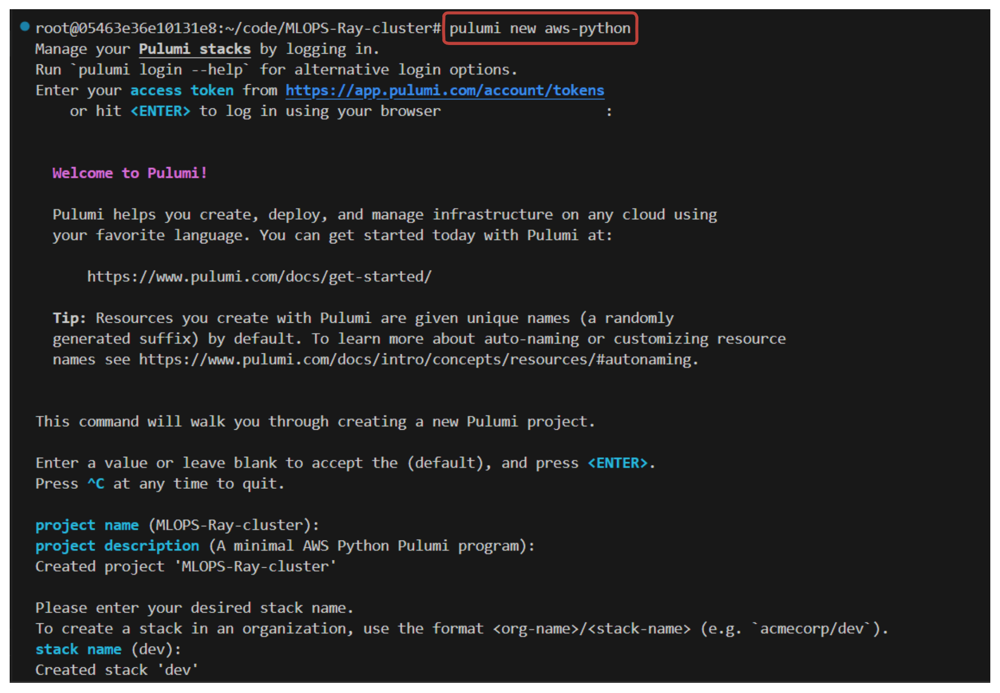
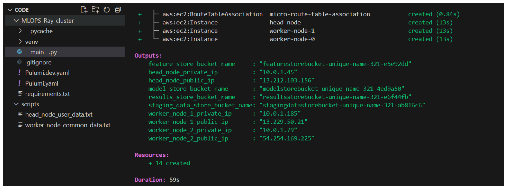
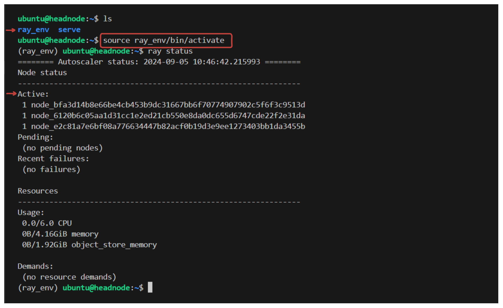

# Ray Cluster Deployment Automation

Welcome to this lab. In this we will deep dive into infrastructure deployment using Pulumi, an open-source infrastructure as code project. We will also **automate** the deployment of Ray clusters. Ray is a high-performance distributed execution framework targeted at large-scale machine learning and reinforcement learning applications.

By the end of this lab, you will have hands-on experience with Pulumi, howt to automate the Ray cluster deployment.

## Overall Architecture

### What is Ray?

Ray is an open-source unified framework for distributed computing, and scaling AI and Python applications like machine learning. It provides the compute layer for parallel processing so that you don’t need to be a distributed systems expert. Ray minimizes the complexity of running your distributed individual and end-to-end machine learning workflows with these components:

- Scalable libraries for common machine learning tasks such as data preprocessing, distributed training, hyperparameter tuning, reinforcement learning, and model serving.
- Pythonic distributed computing primitives for parallelizing and scaling Python applications.
- Integrations and utilities for integrating and deploying a Ray cluster with existing tools and infrastructure such as Kubernetes, AWS, GCP, and Azure.

Ray works by **creating a cluster of nodes** and **scheduling tasks** across them. It uses ***dynamic task*** ***scheduling***, ***a shared memory object store*** for efficient data sharing, supports the actor model for stateful computations, and has native support for Python and Java. It's a powerful tool for distributed computing, providing efficient task scheduling, data sharing, and support for stateful computations.


In this lab, we’ll create a ray cluster with 3 nodes, 

1. One Head Node,
2. Two Worker Nodes, 

Supported by the compute and networking infrastructure of AWS.

## Infrastructure Needed to set up Ray Cluster on AWS

Having the right network configurations and setup in AWS for Ray clusters is crucial for efficient distributed computing.  The compute setup, including the choice of EC2 instances and their configurations, directly impacts the performance and cost-effectiveness of the Ray cluster. 

Moreover, we need robust and dynamic storage support to ingest dataset, store the transformed and computed feature data to a feature store, store the model training and output data.

### Compute Instances Configurations

1. **EC2 Instances**: AWS EC2 instances are used to host the Ray nodes. The instance type (e.g., t3.medium) determines the hardware of the host computer.
2. **AMI (Amazon Machine Image)**: Provides the information required to launch an instance, which is a virtual server in the cloud.
3. **User Data Scripts**: These are used to bootstrap instances, installing necessary software and starting services. In the case of Ray, this might include installing Python, setting up a virtual environment, and installing and starting Ray.

4. **EBS (Elastic Block Store)**: Provides persistent block storage volumes for use with EC2 instances. It's used to store data that should persist beyond the life of the instance.

5. **Key Pair**: Used to securely connect to instances which you have already created and obtained from AWS console. It's crucial for managing the Ray cluster.

### Storage Capabilities

1. **S3 Buckets:** S3 is an object storage of AWS where data is stored in objects, which have three main components: the object’s content or data, a unique identifier for the object, and descriptive metadata including the object’s name, URL, and size

### Networking Configurations

1. **VPC (Virtual Private Cloud)**: An isolated network environment in AWS. It's the foundation of the AWS Cloud network.
2. **Internet Gateway**: Connects the VPC to the internet, enabling Ray nodes to communicate with the outside world.
3. **Subnet**: A segment of the VPC's IP address range where you can place groups of isolated resources. Ray nodes are placed in subnets.
4. **Route Table**: Directs traffic in the VPC. It's important to route traffic correctly between nodes and to/from the internet.
5. **Route Table Association**: Associates a subnet with a route table, ensuring that the Ray nodes in the subnet follow the correct routing rules.
6. **Security Group**: Acts as a virtual firewall for controlling inbound and outbound traffic. It's crucial to allow specific traffic (like SSH) for cluster management and inter-node communication.

## Task Description

In this hands-on lab we will learn 

- How to setup the required infrastructur (VPC, EC2 instances, S3 buckets) using pulumi. In the previous lab, we have installed and configured Ray cluster **manullay**. In this lab we will learn how to install the Ray clusters and necessary libraries in our EC2 instances automatically using **PULUMI**. 

- We will also create a **config** file **dynamically** to SSH into our ray nodes. This file allows us to define shortcuts and advanced SSH options, making the SSH process smoother and more efficient.

- We will config hostname for our EC2 instances so that we can easily identify them in our environment.

> **Note:** This lab is intended to be done in poridhi VS Code. So we will skip the aws cli installation, pulumi installation, and python installation steps as we these are already installed in the VS code environment.


## Step 1. AWS CLI Configuration

Run the following command to configure AWS CLI:

```bash
aws configure
```



This command prompts you for your AWS Access Key ID, Secret Access Key, region, and output format.


##  Step 2: Set Up a Pulumi Project

### Set Up a new directory
Create a new directory for your project and navigate into it:

```sh
mkdir aws-pulumi-infra
cd aws-pulumi-infra
```

### Install python `venv`

```sh 
sudo apt update
sudo apt install python3.8-venv
```

### Initialize a New Pulumi Project
Run the following command to create a new Pulumi project:

```sh
pulumi new aws-python
```
Follow the prompts to set up your project.



### Create Key Pair

Create a new key pair in the `~/.ssh/` directory for the instances using the following command:

```sh
cd ~/.ssh/

aws ec2 create-key-pair --key-name key-pair-poridhi-poc --query 'KeyMaterial' --output text > key-pair-poridhi-poc.pem
```

These commands will create key pair for our instances.

### Set File Permissions of the key files

```sh
chmod 400 key-pair-poridhi-poc.pem
```

### Write Code for infrastructure creation

#### Create a VPC

1. We start by creating a VPC using `aws.ec2.Vpc()`. The VPC has a CIDR block of `10.0.0.0/16`, providing up to 65,536 private IPv4 addresses. DNS support and DNS hostnames are enabled by setting `enable_dns_support=True` and `enable_dns_hostnames=True`. This is essential for our Ray cluster to operate in a secure, isolated network environment.
2. The VPC ID is stored in the `vpc.id` variable.

#### Create an Internet Gateway

1. Next, an Internet Gateway is created using `aws.ec2.InternetGateway()`.
2. This Internet Gateway is attached to the VPC using the `vpc_id` parameter.
3. **Why we need an Internet Gateway (IGW):** It connects the VPC to the internet, enabling Ray nodes to communicate with the outside world, such as downloading dependencies.

#### Create a Public Subnet

1. A public subnet is created using `aws.ec2.Subnet()` within the VPC.
2. The subnet has a CIDR block of `10.0.1.0/24` and is configured to map public IP addresses on launch by setting `map_public_ip_on_launch=True`.
3. **Why a Subnet is Needed:** It provides a segmented IP address range within the VPC where isolated resources, like Ray nodes, can be placed.

#### Create a Route Table

1. A route table is created using `aws.ec2.RouteTable()` and associated with the VPC.
2. A route is added to this table, directing all traffic (`0.0.0.0/0`) to the Internet Gateway created earlier.
3. **Importance for Ray:** This setup ensures proper routing of traffic between Ray nodes and external networks.

#### Associate the Subnet with the Route Table

1. The public subnet is associated with the route table using `aws.ec2.RouteTableAssociation()`.
2. The `subnet_id` and `route_table_id` parameters link the subnet and the route table, ensuring that traffic within the subnet follows the correct routing rules.

#### Create a Security Group

1. A security group is created using `aws.ec2.SecurityGroup()` and is associated with the VPC.
2. The security group is configured with inbound rules to allow traffic on specific ports necessary for Ray:
    - **Port 22:** SSH access to remotely manage the nodes.
    - **Ports 80 and 443:** HTTP and HTTPS traffic for downloading dependencies or data.
    - **Port 6379:** Redis, used by Ray as its primary data store.
    - **Port 8265:** Ray dashboard access.
    - **Ports 1024-65535:** Ephemeral ports required for inter-node communication and various monitoring tools.
3. An outbound rule is added, allowing all traffic (`0.0.0.0/0`) to exit the VPC.

#### Create the Head Node

1. The head node (EC2 instance) is created using `aws.ec2.Instance()` with the following configurations:
    - Instance type: `t3.medium`
    - AMI: `ami-01811d4912b4ccb26` (replace with the correct AMI ID)
    - Security group: the one created earlier
    - Subnet: the public subnet created earlier
    - Key pair: `key-pair-poridhi-poc` (replace with your key pair name)
    - EBS block device: a 20 GB GP3 volume

#### Create the Worker Nodes

1. Two worker nodes (EC2 instances) are created using a loop and `aws.ec2.Instance()` with configurations similar to the head node:
    - Instance type: `t3.small`
    - AMI: `ami-01811d4912b4ccb26` (replace with the correct AMI ID)
    - Security group: the one created earlier
    - Subnet: the public subnet created earlier
    - Key pair: `key-pair-poridhi-poc` (replace with your key pair name)
    - EBS block device: a 20 GB GP3 volume

#### Create S3 Buckets

1. The code creates four S3 buckets, each with a unique name and versioning enabled. These buckets will serve as storage for staging raw datasets, feature stores, model training data, and model outputs.

#### Export Outputs

1. The public IP, private IP addresses of the head node and worker nodes are exported as Pulumi outputs, along with the names of the S3 buckets.


Now, **Open `__main__.py` file in your project directory**:

```python
import pulumi
import pulumi_aws as aws
import os

# Create a VPC
vpc = aws.ec2.Vpc("micro-vpc",
    cidr_block="10.0.0.0/16",
    enable_dns_support=True,
    enable_dns_hostnames=True
)

# Create an Internet Gateway
internet_gateway = aws.ec2.InternetGateway("micro-igw",
    vpc_id=vpc.id
)

# Create a Public Subnet
subnet = aws.ec2.Subnet("micro-subnet",
    vpc_id=vpc.id,
    cidr_block="10.0.1.0/24",
    map_public_ip_on_launch=True
)

# Create a route table
route_table = aws.ec2.RouteTable("micro-route-table",
    vpc_id=vpc.id,
    routes=[aws.ec2.RouteTableRouteArgs(
        cidr_block="0.0.0.0/0",
        gateway_id=internet_gateway.id,
    )]
)

# Associate the subnet with the route table
route_table_association = aws.ec2.RouteTableAssociation("micro-route-table-association",
    subnet_id=subnet.id,
    route_table_id=route_table.id
)

# Security Group allowing SSH and HTTP
security_group = aws.ec2.SecurityGroup("micro-sec-group",
    vpc_id=vpc.id,
    description="Allow SSH and HTTP",
    ingress=[
        aws.ec2.SecurityGroupIngressArgs(
            protocol="tcp",
            from_port=22,
            to_port=22,
            cidr_blocks=["0.0.0.0/0"],
        ),
        aws.ec2.SecurityGroupIngressArgs(
            protocol="tcp",
            from_port=80,
            to_port=80,
            cidr_blocks=["0.0.0.0/0"],
        ),
        aws.ec2.SecurityGroupIngressArgs(
            protocol="tcp",
            from_port=443,
            to_port=443,
            cidr_blocks=["0.0.0.0/0"],
        ),
        aws.ec2.SecurityGroupIngressArgs(
            protocol='tcp',
            from_port=6379,
            to_port=6382,
            cidr_blocks=['0.0.0.0/0'],  # Allow from anywhere
        ),
        aws.ec2.SecurityGroupIngressArgs(
            protocol='tcp',
            from_port=1024,
            to_port=65535,
            cidr_blocks=['0.0.0.0/0'],
        ),
    ],
    egress=[
        aws.ec2.SecurityGroupEgressArgs(
            protocol="-1",
            from_port=0,
            to_port=0,
            cidr_blocks=["0.0.0.0/0"],
        ),
    ],
)

with open('/root/code/scripts/head_node_user_data.txt', 'r') as file:
    head_node_user_data = file.read()

# Create the head node
head_node = aws.ec2.Instance('head-node',
    instance_type='t3.medium',
    ami='ami-01811d4912b4ccb26',
    vpc_security_group_ids=[security_group.id],
    subnet_id=subnet.id,
    user_data=head_node_user_data,
    key_name='key-pair-poridhi-poc',
    ebs_block_devices=[
        aws.ec2.InstanceEbsBlockDeviceArgs(
            device_name="/dev/sda1",
            volume_type="gp3",
            volume_size=20,
            delete_on_termination=True,
        ),
    ],
)

with open('/root/code/scripts/worker_node_common_data.txt', 'r') as file:
    worker_node_common_data = file.read()


# Create worker nodes
worker_nodes = []
for i in range(2):
    worker_node_user_data = head_node.private_ip.apply(lambda ip: worker_node_common_data  + f"""
ray start --address='{ip}:6379'
""")
    worker_node = aws.ec2.Instance(f'worker-node-{i}',
        instance_type='t3.small',
        ami='ami-01811d4912b4ccb26',
        vpc_security_group_ids=[security_group.id],
        subnet_id=subnet.id,
        user_data=worker_node_user_data,
        key_name='key-pair-poridhi-poc',
        ebs_block_devices=[
            aws.ec2.InstanceEbsBlockDeviceArgs(
            device_name="/dev/sda1",
            volume_type="gp3",
            volume_size=20,
            delete_on_termination=True,
            ),
        ],
    )
    worker_nodes.append(worker_node)

# Output the private IP addresses
pulumi.export('head_node_private_ip', head_node.private_ip)
pulumi.export('head_node_public_ip', head_node.public_ip)


for i, worker_node in enumerate(worker_nodes):
    pulumi.export(f'worker_node_{i}_private_ip', worker_node.private_ip)
    pulumi.export(f'worker_node_{i}_public_ip', worker_node.public_ip)


# Create a dynamic config file for SSH access
def create_config_file(ip_list):
    # Define the hostnames for each IP address
    hostnames = ['headnode', 'worker1', 'worker2']
    
    config_content = ""
    
    # Iterate over IP addresses and corresponding hostnames
    for hostname, ip in zip(hostnames, ip_list):
        config_content += f"Host {hostname}\n"
        config_content += f"    HostName {ip}\n"
        config_content += f"    User ubuntu\n"
        config_content += f"    IdentityFile ~/.ssh/key-pair-poridhi-poc.pem\n\n"
    
    # Write the content to the SSH config file
    config_path = os.path.expanduser("~/.ssh/config")
    with open(config_path, "w") as config_file:
        config_file.write(config_content)

# Collect the IPs for all nodes
all_ips = [head_node.public_ip] + [worker_node.public_ip for worker_node in worker_nodes]

# Create the config file with the IPs once the instances are ready
pulumi.Output.all(*all_ips).apply(create_config_file)


# Create specific S3 buckets with unique names
staging_data_store_bucket = aws.s3.Bucket("stagingdatastorebucket-unique-name-321",
    acl="private",  # Example ACL configuration
    versioning=aws.s3.BucketVersioningArgs(
        enabled=True,
    ),
)

feature_store_bucket = aws.s3.Bucket("featurestorebucket-unique-name-321",
    acl="private",  # Example ACL configuration
    versioning=aws.s3.BucketVersioningArgs(
        enabled=True,
    ),
)

model_store_bucket = aws.s3.Bucket("modelstorebucket-unique-name-321",
    acl="private",  # Example ACL configuration
    versioning=aws.s3.BucketVersioningArgs(
        enabled=True,
    ),
)

results_store_bucket = aws.s3.Bucket("resultsstorebucket-unique-name-321",
    acl="private",  # Example ACL configuration
    versioning=aws.s3.BucketVersioningArgs(
        enabled=True,
    ),
)

# Export the names of the created buckets
pulumi.export('staging_data_store_bucket_name', staging_data_store_bucket.id)
pulumi.export('feature_store_bucket_name', feature_store_bucket.id)
pulumi.export('model_store_bucket_name', model_store_bucket.id)
pulumi.export('results_store_bucket_name', results_store_bucket.id)
```

### Deploy the Pulumi Stack

Deploy the stack using the following command:

```sh
pulumi up
```
Review the changes and confirm by typing "yes".

## Step 3: Set the hostname of the instances

We can set the hostname for our instances by using the `hostnamectl` command. This will help us to easily identify at which instance we are now after we ssh into any instance.


- SSH into the headenode instance and use the following command:

    ```bash
    sudo hostnamectl set-hostname headnode
    ```

    Exit and SSH again to see if it works.

    

- SSH into the workernode 1 using `ssh worker1` and do the same here as well:

    ```bash
    sudo hostnamectl set-hostname worker-1
    ```

    Now, exit and ssh again to see if it works.

-  SSH into the workernode 2 using `ssh worker2`:

    ```bash
    sudo hostnamectl set-hostname worker-2
    ```

    Now, exit and ssh again to see if it works.


## Conclusion

In this lab, we successfully leveraged Pulumi to automate the deployment of critical AWS infrastructure components and Ray Cluster Deployment, setting the stage for efficient and scalable machine learning operations. By automating the creation of VPCs, subnets, EC2 instances, security groups, and S3 buckets, we laid a robust foundation for deploying a distributed Ray cluster. This hands-on experience not only simplifies the infrastructure setup but also empowers you to focus on building and scaling your machine learning applications with Ray.