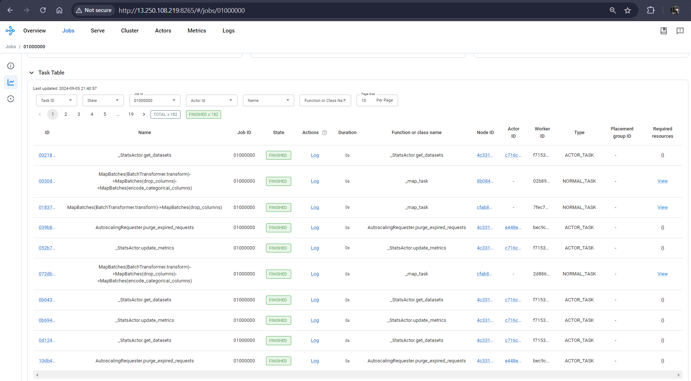

# Feature Engineering With Ray And AWS

## Clone the Repo of this Lab

```bash
git clone <<<<git repo url>>>>>
```

All the necessary files, notebooks are in this repo, change the directory to see the files. We’ll interact with them through Jupyter Lab later in this lab.

```bash
cd cloned_repo_dir
```

## Run Jupyter Lab

We will use Jupyter Lab for scripting and running the training/inferencng scripts.

Try to open another terminal window for this task as the terminal have to be on while running the jupyter lab.

1. Head back to the head node and change the directory to the cloned repo.
2. Start the jupyter lab (Make sure you are in the right directory). 

```bash
jupyter lab
```

Jupyter lab will be started on port 8888.


Go to a browser and paste the URL marked in the picture. Replace `headnode` with the public ip of the headnode instance.

All the necessary files for our problem are already in this working directory.

## Attach an IAM Role to the EC2 Instances for S3 Buckets permissions

Let’s create an IAM role with the necessary permissions for EC2 instances to write to our S3 buckets.

### Create an IAM Role

- Go to the IAM console and create a new role.
- Select trusted entity type as `AWS service` and usecase as `EC2` as we are creating the role for EC2 instances.

    

- Give a name to the role and click `Create role`.

    

### Attach Policy for Permissions

- On the role summary page, under the "Permissions" tab, click on the "Add permissions" button.
- Choose `Create inline policy`.

    

- Attach the following `json` file in the policy editor:

    ```json
    {
        "Version": "2012-10-17",
        "Statement": [
            {
                "Effect": "Allow",
                "Action": [
                    "s3:PutObject",
                    "s3:GetObject",
                    "s3:GetObjectVersion",
                    "s3:ListBucket",
                    "s3:ListBucketVersions"
                ],
                "Resource": [
                    "arn:aws:s3:::stagingdatastorebucket-unique-name-321-bf73fa4",
                    "arn:aws:s3:::stagingdatastorebucket-unique-name-321-bf73fa4/staging-directory/*",
                    "arn:aws:s3:::featurestorebucket-unique-name-321-0c6657a",
                    "arn:aws:s3:::featurestorebucket-unique-name-321-0c6657a/*",
                    "arn:aws:s3:::modelstorebucket-unique-name-321-9847f67",
                    "arn:aws:s3:::modelstorebucket-unique-name-321-9847f67/*",
                    "arn:aws:s3:::resultsstorebucket-unique-name-321-0876e55",
                    "arn:aws:s3:::resultsstorebucket-unique-name-321-0876e55/*"
                ]
            }
        ]
    }
    ```
    Replace the bucket names with your actual bucket names.


### Attach the Role to EC2 instances

- Go to the EC2 Dashboard.
- Select the instances you created (`headnode`, `worker1`, `worker2`), to attach the role.
- Click on Actions > Security > Modify IAM Role.
- In the dropdown list, you should see the role you created. Select it and click `Update IAM Role`.

    

- Repeat these steps for worker nodes also.

## Run the Data Transformation & Feature Store Notebook

Here’s a detailed explanation of the steps and why each of them is important in the context of preparing a dataset for machine learning, specifically for our dataset.

### 1. **Setting Up the Environment**
   - **AWS Setup with `boto3`**: 
     -    AWS S3 is being used as a data storage solution, particularly because it’s scalable, durable, and can handle large datasets efficiently. Setting up `boto3`, the AWS SDK for Python, allows you to interact programmatically with S3 buckets where the data will be stored, processed, and later retrieved.
     -  This setup is critical because it ensures secure and organized storage of the datasets, which is essential for a reproducible and scalable machine learning workflow.

   - **S3 Bucket Interaction**:
     -    Listing the S3 buckets helps in verifying that the necessary storage infrastructure (like buckets for staging, feature store, and model store) is in place.
     -  This is necessary to confirm that the data pipelines will function as expected, with each bucket serving a specific purpose in the workflow (e.g., storing raw data, processed features, or model outputs).

### 2. **Data Ingestion**
   - **Upload Raw Data**:
     -    The raw dataset is uploaded to a staging S3 bucket. This dataset contains the energy consumption data, which is the primary input for the machine learning model.
     -  Staging the data in S3 ensures that it is securely stored and easily accessible for further processing steps. This also allows for version control of data and easy integration with various data processing tools.

   - **Load Data from S3**:
     -    The dataset is read from the staging bucket into a `Ray` dataset, a distributed data processing framework that can handle large-scale data operations efficiently.
     -  Using `Ray` allows for parallelized data processing, which speeds up the workflow, making it more efficient and scalable, especially for large datasets.

### 3. **Exploratory Data Analysis (EDA)**
   - **Visualization with `plotly`**:
     -    Visualize the energy consumption trends over time to understand the data's underlying patterns, such as peak usage hours or seasonal variations.
     -  EDA is crucial for uncovering insights and identifying trends in the data that will inform feature engineering and model selection. Visualizing data helps in making informed decisions about which features are important for predicting energy consumption.

   - **Key Findings**:
     -    Identify the key trends, such as high energy consumption during summer months and lower usage in other seasons.
     -  Understanding these patterns is essential for building accurate predictive models. It highlights the need to account for seasonality and time-based trends in the modeling process.

### 4. **Feature Engineering**
   - **New Features Creation**:
     -    Develop new features that capture temporal and seasonal patterns, such as `TimeOfDay` and `Season`.
     -  These new features help the machine learning model better understand the context in which energy is consumed, leading to more accurate predictions. For example, energy usage patterns differ significantly between morning and evening, so creating a `TimeOfDay` feature allows the model to learn these differences.

   - **Batch Transformation**:
     -    Apply transformations to the dataset in batches to compute the new features across the entire dataset efficiently.
     -  Batch processing is efficient and scalable, allowing for the transformation of large datasets without overwhelming system resources.

### 5. **Data Cleaning and Preprocessing**
   - **Drop Unnecessary Columns**:
     -    Remove columns that are not needed for modeling to reduce noise and improve model performance.
     -  Simplifying the dataset by removing irrelevant columns can help in focusing the model on the most important features, thereby improving accuracy and reducing overfitting.

   - **Inspect Column Types**:
     -    Identify which columns are categorical and which are numerical to determine the appropriate preprocessing steps (like encoding for categorical variables).
     -  Proper identification of column types is essential for applying the right transformations, such as one-hot encoding for categorical data or scaling for numerical data.

### 6. **Encoding Categorical Variables**
   - **One-Hot Encoding**:
     -    Convert categorical variables (like `TimeOfDay` and `Season`) into numerical format using one-hot encoding.
     -  Machine learning models typically require numerical input. One-hot encoding allows the model to use categorical information without assuming any ordinal relationship between categories.

### 7. **Aggregation**
   - **Data Aggregation**:
     -    Group the data by `Year`, `Month`, `Day`, and `Hour` and aggregate values such as temperature and power consumption using methods like mean and sum.
     -  Aggregating the data into hourly intervals helps to reduce data dimensionality and focus on patterns over more significant time periods, which is important for time-series analysis and prediction. It also smooths out noise and makes the dataset more manageable for modeling.

### 8. **Lag Feature Creation**
   - **Lag Shifting**:
     -    Create lag features that represent previous values of key variables, such as temperature or power consumption, at different time intervals (e.g., 4 hours ago, 24 hours ago).
     -  Lag features help capture temporal dependencies in time-series data. For instance, energy consumption at a certain time is often influenced by consumption patterns in the preceding hours. Including lag features allows the model to learn from past behaviors, which is crucial for accurate forecasting.

### 9. **Feature Scaling**
   - **Scaling**:
     -    Normalize or scale the features so they have a common range, typically between 0 and 1 or -1 and 1.
     -  Scaling is important because many machine learning algorithms are sensitive to the range of input data. Features with larger ranges can disproportionately influence the model's predictions. Scaling ensures that each feature contributes equally to the model's decision-making process.

### 10. **Ray Dashboard**
   - **Monitor Processing**:
     -    Use the Ray dashboard to monitor the execution of jobs on the dataset, ensuring that all tasks (like transformations, aggregations, and feature engineering) are completed correctly.
     -  Monitoring helps in identifying bottlenecks or errors in the data processing pipeline. It provides visibility into the progress of distributed tasks and ensures that the data is processed as expected before moving on to modeling.

## Conclusion
The goal of this entire workflow is to transform raw energy consumption data into a well-structured, feature-rich dataset that can be used to train accurate and efficient machine learning models. Each step in this process—ranging from data ingestion and exploratory analysis to feature engineering and scaling—ensures that the data is clean, relevant, and prepared for predictive modeling, ultimately leading to better and more reliable predictions of energy consumption patterns.

