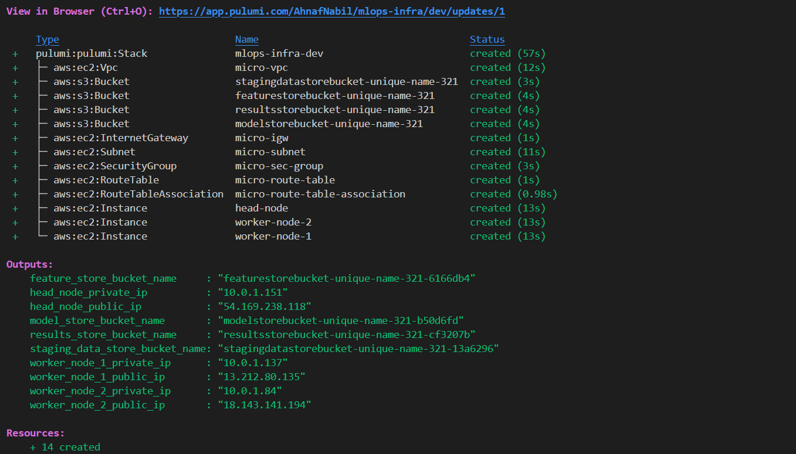
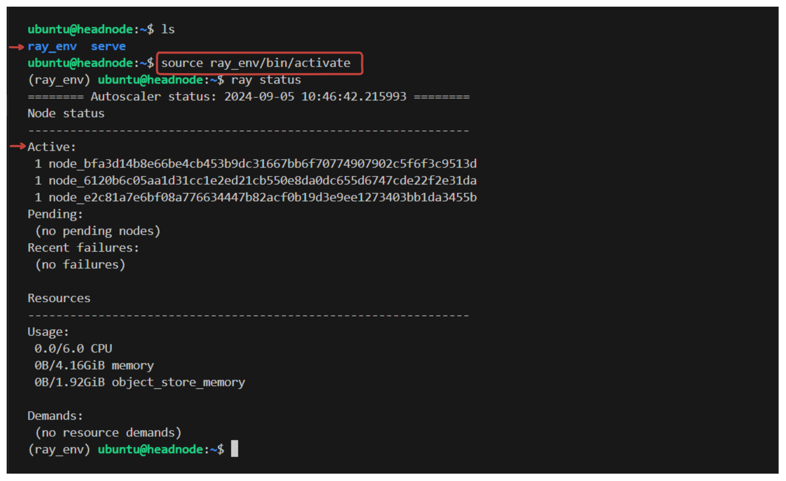
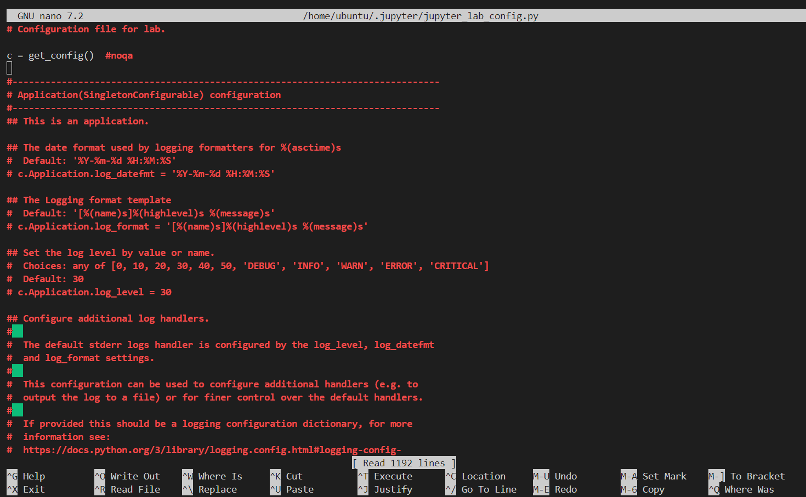
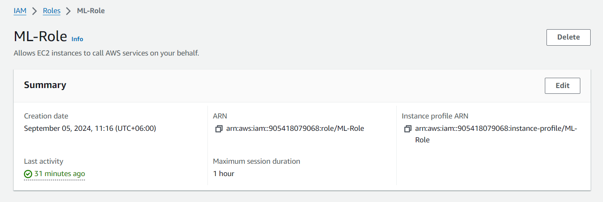
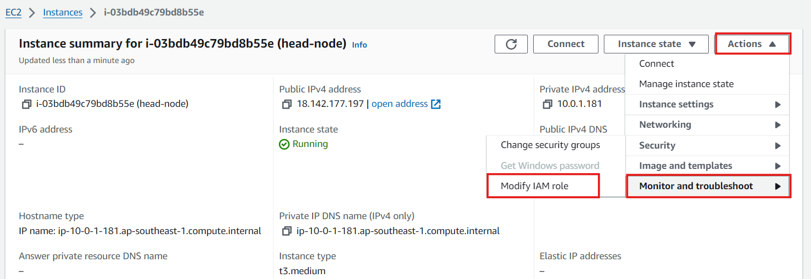
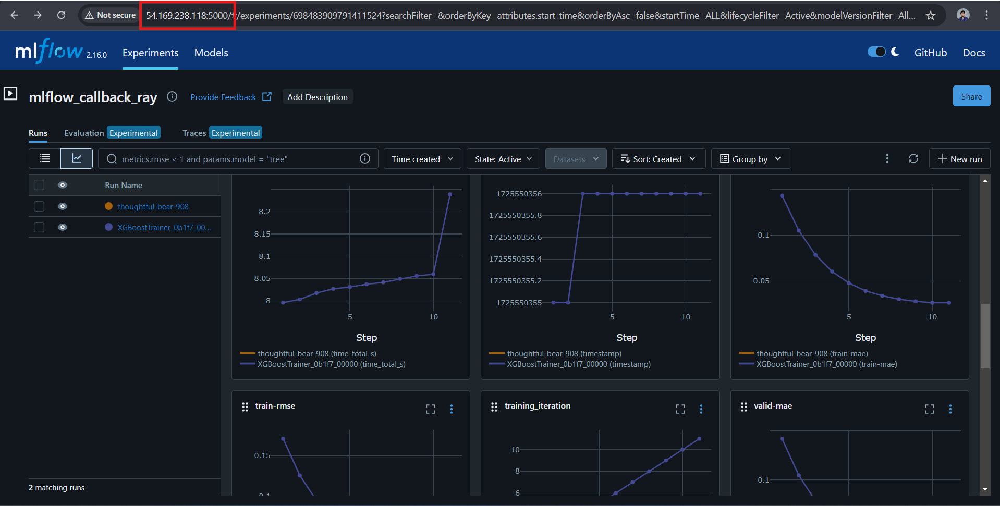
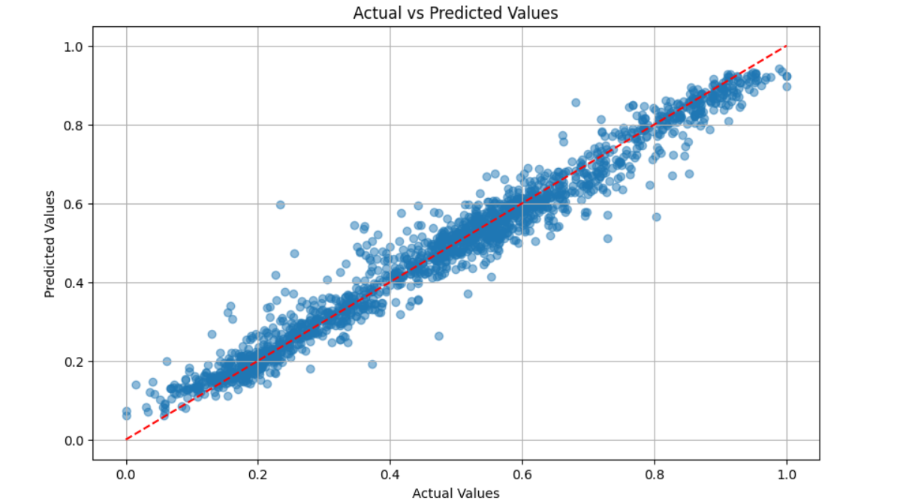
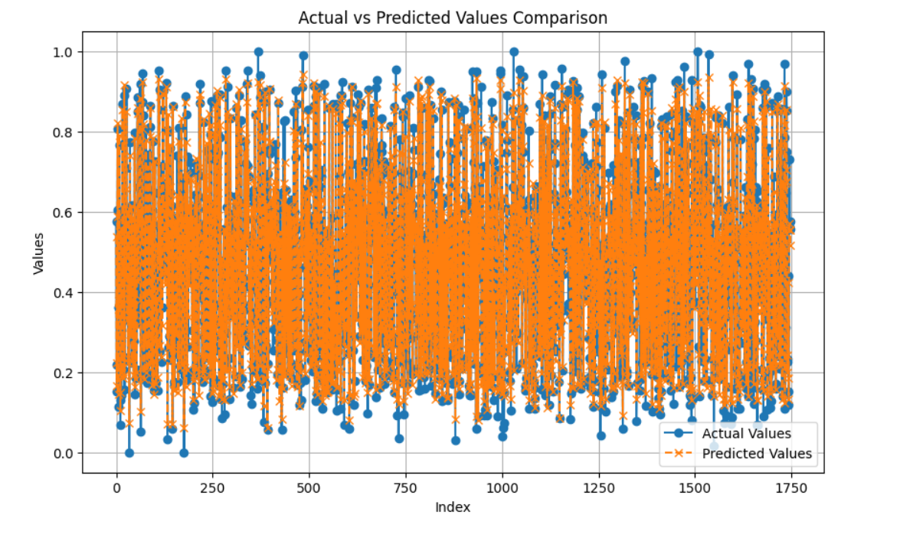

# Model Training and MLflow Visualization

In this lab, we build on the foundational data engineering practices established in our previous work, where we utilized a staging data store to manage and transform raw datasets. We previously focused on storing and processing raw data in the `stagingdatastorebucket`, followed by applying various transformations and feature engineering tasks. The processed data was then saved in the `featurestorebucket` for future use. 


In this lab, we advance this workflow by preparing the data for model training. Specifically, we will ingest the engineered features from the feature store into the `modelstorebucket`, followed by loading the data into the model training function from the `modeldatastorebucket`. After training, the model outputs, predictions, and results will be securely stored in the `resultsstorebucket`. This structured approach ensures that each stage of the machine learning pipeline is handled with precision, from data preparation to model deployment, facilitating a seamless and scalable workflow.


## Task Description

In this lab, we will:

- AWS CLI configuration
- Create AWS infrastructure (VPC, instance, S3 bucket) using Pulumi
- Clone the repository that contains the notebook for this lab
- Run the jupyter lab 
- Attach an IAM Role to the EC2 Instances for S3 Buckets permissions
- Run a python file for data transformation and feature store step
- Run the notebook `2. training-and-saving-the-model.ipynb`

## AWS CLI Configuration

Run the following command to configure AWS CLI:

```bash
aws configure
```

This command prompts you for your AWS Access Key ID, Secret Access Key, region, and output format.


## Set Up a Pulumi Project

### Set Up a new directory
Create a new directory for your project and navigate into it:

```sh
mkdir aws-pulumi-infra
cd aws-pulumi-infra
```

### Install python `venv`

```sh 
sudo apt update
sudo apt install python3.8-venv
```

### Initialize a New Pulumi Project
Run the following command to create a new Pulumi project:

```sh
pulumi new aws-python
```
Follow the prompts to set up your project.

### Create Key Pair

Create a new key pair in the `~/.ssh/` directory for the instances using the following command:

```sh
cd ~/.ssh/

aws ec2 create-key-pair --key-name key-pair-poridhi-poc --query 'KeyMaterial' --output text > key-pair-poridhi-poc.pem
```

These commands will create key pair for our instances.

### Set File Permissions of the key files

```sh
chmod 400 key-pair-poridhi-poc.pem
```


### Write the scripts

1. Open a directory named `scripts`

    ```sh
    mkdir scripts
    ```

2. Create a file named `head_node_user_data.txt` and add the following code to it

    ```sh
    #!/bin/bash

    # Change to the home directory
    cd /home/ubuntu/

    # Update the package list and install necessary software properties
    sudo apt-get update
    sudo apt-get install -y software-properties-common

    # Add the deadsnakes PPA and install Python 3.9 and related packages
    sudo add-apt-repository -y ppa:deadsnakes/ppa
    sudo apt-get update
    sudo apt-get install -y python3.9 python3.9-venv python3.9-dev

    # Create a Python virtual environment and activate it
    python3.9 -m venv ray_env
    source ray_env/bin/activate

    # Install Python libraries within the virtual environment
    pip install boto3 pyarrow numpy pandas matplotlib seaborn plotly scikit-learn xgboost -U ipywidgets

    # Install jupyter lab
    pip install jupyterlab

    # Install Ray and start Ray as the head node
    pip install "ray[default] @ https://s3-us-west-2.amazonaws.com/ray-wheels/latest/ray-3.0.0.dev0-cp39-cp39-manylinux2014_x86_64.whl"

    # Install ray server
    pip install "ray[serve]"

    # Install py-ubjson
    pip install py-ubjson

    # Install modin-ray
    pip install modin[ray]

    # Install mlflow
    pip install mlflow

    # Install missingno
    pip install missingno

    ray start --head --port=6379 --dashboard-host=0.0.0.0 --dashboard-port=8265 --include-dashboard=True

    # Check Ray's status
    ray status
    ```
3. Create a file named `worker_node_common_data.txt` and add the following code to it

    ```sh
    #!/bin/bash

    cd /home/ubuntu/

    # Update the package list and install necessary software properties
    sudo apt-get update
    sudo apt-get install -y software-properties-common

    # Add the deadsnakes PPA and install Python 3.9 and related packages
    sudo add-apt-repository -y ppa:deadsnakes/ppa
    sudo apt-get update
    sudo apt-get install -y python3.9 python3.9-venv python3.9-dev

    # Create a Python virtual environment and activate it
    python3.9 -m venv ray_env
    source ray_env/bin/activate

    # Install Python libraries within the virtual environment
    pip install boto3 pyarrow numpy pandas matplotlib seaborn plotly scikit-learn xgboost -U ipywidgets

    # Install jupyter lab
    pip install jupyterlab

    # Install Ray and start Ray as the head node
    pip install "ray[default] @ https://s3-us-west-2.amazonaws.com/ray-wheels/latest/ray-3.0.0.dev0-cp39-cp39-manylinux2014_x86_64.whl"

    # Install ray server
    pip install "ray[serve]"

    # Install py-ubjson
    pip install py-ubjson

    # Install modin-ray
    pip install modin[ray]

    # Install mlflow
    pip install mlflow

    # Install missingno
    pip install missingno
    ```


### Edit the pulumi code in `__main__.py` file:

```py
import pulumi
import pulumi_aws as aws
import os

# Create a VPC
vpc = aws.ec2.Vpc("micro-vpc",
    cidr_block="10.0.0.0/16",
    enable_dns_support=True,
    enable_dns_hostnames=True
)

# Create an Internet Gateway
internet_gateway = aws.ec2.InternetGateway("micro-igw",
    vpc_id=vpc.id
)

# Create a Public Subnet
subnet = aws.ec2.Subnet("micro-subnet",
    vpc_id=vpc.id,
    cidr_block="10.0.1.0/24",
    map_public_ip_on_launch=True
)

# Create a route table
route_table = aws.ec2.RouteTable("micro-route-table",
    vpc_id=vpc.id,
    routes=[aws.ec2.RouteTableRouteArgs(
        cidr_block="0.0.0.0/0",
        gateway_id=internet_gateway.id,
    )]
)

# Associate the subnet with the route table
route_table_association = aws.ec2.RouteTableAssociation("micro-route-table-association",
    subnet_id=subnet.id,
    route_table_id=route_table.id
)

# Security Group allowing SSH and HTTP
security_group = aws.ec2.SecurityGroup("micro-sec-group",
    vpc_id=vpc.id,
    description="Allow SSH and HTTP",
    ingress=[
        aws.ec2.SecurityGroupIngressArgs(
            protocol="tcp",
            from_port=22,
            to_port=22,
            cidr_blocks=["0.0.0.0/0"],
        ),
        aws.ec2.SecurityGroupIngressArgs(
            protocol="tcp",
            from_port=80,
            to_port=80,
            cidr_blocks=["0.0.0.0/0"],
        ),
        aws.ec2.SecurityGroupIngressArgs(
            protocol="tcp",
            from_port=443,
            to_port=443,
            cidr_blocks=["0.0.0.0/0"],
        ),
        aws.ec2.SecurityGroupIngressArgs(
            protocol='tcp',
            from_port=6379,
            to_port=6382,
            cidr_blocks=['0.0.0.0/0'],  # Allow from anywhere
        ),
        aws.ec2.SecurityGroupIngressArgs(
            protocol='tcp',
            from_port=1024,
            to_port=65535,
            cidr_blocks=['0.0.0.0/0'],
        ),
    ],
    egress=[
        aws.ec2.SecurityGroupEgressArgs(
            protocol="-1",
            from_port=0,
            to_port=0,
            cidr_blocks=["0.0.0.0/0"],
        ),
    ],
)

# Read the head_node_user_data.txt file. Update your path accordingly
with open('/root/code/scripts/head_node_user_data.txt', 'r') as file:
    head_node_user_data = file.read()

# Create the head node
head_node = aws.ec2.Instance('head-node',
    instance_type='t3.medium',
    ami='ami-01811d4912b4ccb26',
    vpc_security_group_ids=[security_group.id],
    subnet_id=subnet.id,
    user_data=head_node_user_data, # pass the head-node-user-data
    key_name='key-pair-poridhi-poc',
    ebs_block_devices=[
        aws.ec2.InstanceEbsBlockDeviceArgs(
            device_name="/dev/sda1",
            volume_type="gp3",
            volume_size=20,
            delete_on_termination=True,
        ),
    ],
    tags={
      'Name': 'head-node',
    }
)

# Read the worker_node_common_data.txt user. Update your path accordingly
with open('/root/code/scripts/worker_node_common_data.txt', 'r') as file:
    worker_node_common_data = file.read()


# Create worker nodes
worker_nodes = []
for i in range(2):
    worker_node_user_data = head_node.private_ip.apply(lambda ip: worker_node_common_data  + f"""
ray start --address='{ip}:6379'
""") # The private IP of the head node is passed dynamically to the worker nodes, so they can connect to the head node via Ray (ray start command).
    worker_node = aws.ec2.Instance(f'worker-node-{i+1}',
        instance_type='t3.small',
        ami='ami-01811d4912b4ccb26',
        vpc_security_group_ids=[security_group.id],
        subnet_id=subnet.id,
        user_data=worker_node_user_data, # pass the worker node user data
        key_name='key-pair-poridhi-poc',
        ebs_block_devices=[
            aws.ec2.InstanceEbsBlockDeviceArgs(
            device_name="/dev/sda1",
            volume_type="gp3",
            volume_size=20,
            delete_on_termination=True,
            ),
        ],
        tags={
            'Name': f'worker-node-{i+1}',
        }
    )
    worker_nodes.append(worker_node)

# Output the public and private IP addresses
pulumi.export('head_node_private_ip', head_node.private_ip)
pulumi.export('head_node_public_ip', head_node.public_ip)

# Export the worker node public and private ip
for i, worker_node in enumerate(worker_nodes):
    pulumi.export(f'worker_node_{i+1}_private_ip', worker_node.private_ip)
    pulumi.export(f'worker_node_{i+1}_public_ip', worker_node.public_ip)


# Create a dynamic config file for SSH access
def create_config_file(ip_list):
    # Define the hostnames for each IP address
    hostnames = ['headnode', 'worker1', 'worker2']
    
    config_content = ""
    
    # Iterate over IP addresses and corresponding hostnames
    for hostname, ip in zip(hostnames, ip_list):
        config_content += f"Host {hostname}\n"
        config_content += f"    HostName {ip}\n"
        config_content += f"    User ubuntu\n"
        config_content += f"    IdentityFile ~/.ssh/key-pair-poridhi-poc.pem\n\n"
    
    # Write the content to the SSH config file
    config_path = os.path.expanduser("~/.ssh/config")
    with open(config_path, "w") as config_file:
        config_file.write(config_content)

# Collect the IPs for all nodes
all_ips = [head_node.public_ip] + [worker_node.public_ip for worker_node in worker_nodes]

# Create the config file with the IPs once the instances are ready
pulumi.Output.all(*all_ips).apply(create_config_file)


# Create Staging S3 bucket with unique names
staging_data_store_bucket = aws.s3.Bucket("stagingdatastorebucket-unique-name-321",
    acl="private",  # Example ACL configuration
    versioning=aws.s3.BucketVersioningArgs(
        enabled=True,
    ),
)

# Create Feature store bucket
feature_store_bucket = aws.s3.Bucket("featurestorebucket-unique-name-321",
    acl="private",  # Example ACL configuration
    versioning=aws.s3.BucketVersioningArgs(
        enabled=True,
    ),
)

# Create Model store bucket
model_store_bucket = aws.s3.Bucket("modelstorebucket-unique-name-321",
    acl="private",  # Example ACL configuration
    versioning=aws.s3.BucketVersioningArgs(
        enabled=True,
    ),
)

# Create Results store bucket
results_store_bucket = aws.s3.Bucket("resultsstorebucket-unique-name-321",
    acl="private",  # Example ACL configuration
    versioning=aws.s3.BucketVersioningArgs(
        enabled=True,
    ),
)

# Export the names of the created buckets
pulumi.export('staging_data_store_bucket_name', staging_data_store_bucket.id)
pulumi.export('feature_store_bucket_name', feature_store_bucket.id)
pulumi.export('model_store_bucket_name', model_store_bucket.id)
pulumi.export('results_store_bucket_name', results_store_bucket.id)
```

### Deploy the Pulumi Stack

Deploy the stack using the following command:

```sh
pulumi up
```
Review the changes and confirm by typing `yes`.



### Check the Ray Status on the Head Node

1. **SSH into the Head Node:**

   First, log into the head node using SSH.

   ```sh
   ssh headnode
   source ray_env/bin/activate
   ```

2. **Check Ray Cluster Status:**

   After logging in, run the following command to check the status of the Ray cluster:

   ```sh
   ray status
   ```

   > **Note:** It may take a few minutes for all nodes to connect and the cluster to become fully operational after deployment. Be patient while the system initializes.

   


## Change File Ownership and Permissions

In some cases, certain directories or files may have restricted permissions or be owned by the `root` user, which can interfere with the smooth operation of Ray or cause permission-related issues. To prevent this, adjust the ownership and permissions as follows:

1. **Change Ownership of the Ray Environment Directory:**

   To change ownership of the Ray environment directory to the `ubuntu` user, run the following command:

   ```sh
   sudo chown -R ubuntu:ubuntu /home/ubuntu/ray_env
   ```

   This command recursively modifies the ownership of all files and directories under `/home/ubuntu/ray_env`, ensuring the `ubuntu` user has full control.

2. **Change Ownership of the Ray Temporary Files:**

   Similarly, you may also need to adjust the ownership of the Ray-related files in the `/tmp/ray` directory. Run:

   ```sh
   sudo chown -R ubuntu:ubuntu /tmp/ray/*
   ```

   

   This ensures the `ubuntu` user has the necessary permissions to manage Ray processes, which often store temporary files in this location.


## Clone the Repository of this Lab

```bash
git clone https://github.com/Galadon123/ML.git
```

All the necessary files, notebooks are in this repo, change the directory to see the files. We’ll interact with them through Jupyter Lab later in this lab.
The notebook required for this lab is in the `MLOPS-LAB-2` directory. We will running `1.data-transformation-and-feature-store.ipynb` notebook.

```bash
cd ML
cd MLOPS-LAB-2
```

## Run Jupyter Lab

SSH into headnode and activate the ray_env:

```bash
ssh headnode
source ray_env/bin/activate
```

Run the following commands to create a configuration file for the Jupyter Lab:

```bash
jupyter lab --generate-config
mkdir -p ~/.jupyter
nano ~/.jupyter/jupyter_lab_config.py
```

This commands will open a config file as follows:



Add the following configuration:

```
# Allow all IP addresses to connect
c.ServerApp.ip = '0.0.0.0'

# Allow the server to be accessible from the public internet
c.ServerApp.open_browser = False

# Set the port (default is 8888)
c.ServerApp.port = 8888
```


Now, save and exit the file. 

Head back to the head node and change the directory to the cloned repo. Start the jupyter lab (Make sure you are in the right directory). 

```bash
jupyter lab
```

Jupyter lab will be started on port `8888`.


Go to a browser and paste the URL marked in the picture. Replace `headnode` with the `public-ip` of the headnode instance.

All the necessary files for our problem are already in this working directory.
Jupyter lab will be started on port 8888.

## Attach an IAM Role to the EC2 Instances for S3 Buckets permissions

Let’s create an IAM role with the necessary permissions for EC2 instances to write to our S3 buckets.

### Create an IAM Role

- Go to the IAM console and create a new role.
- Select trusted entity type as `AWS service` and usecase as `EC2` as we are creating the role for EC2 instances.

    

- Give a name to the role and click `Create role`.

    

### Attach Policy for Permissions

- On the role summary page, under the "Permissions" tab, click on the "Add permissions" button.
- Choose `Create inline policy`.

    

- Attach the following `json` file in the policy editor:

    ```json
    {
        "Version": "2012-10-17",
        "Statement": [
            {
                "Effect": "Allow",
                "Action": [
                    "s3:PutObject",
                    "s3:GetObject",
                    "s3:GetObjectVersion",
                    "s3:ListBucket",
                    "s3:ListBucketVersions"
                ],
                "Resource": [
                    "arn:aws:s3:::stagingdatastorebucket-unique-name-321-bf73fa4",
                    "arn:aws:s3:::stagingdatastorebucket-unique-name-321-bf73fa4/staging-directory/*",
                    "arn:aws:s3:::featurestorebucket-unique-name-321-0c6657a",
                    "arn:aws:s3:::featurestorebucket-unique-name-321-0c6657a/*",
                    "arn:aws:s3:::modelstorebucket-unique-name-321-9847f67",
                    "arn:aws:s3:::modelstorebucket-unique-name-321-9847f67/*",
                    "arn:aws:s3:::resultsstorebucket-unique-name-321-0876e55",
                    "arn:aws:s3:::resultsstorebucket-unique-name-321-0876e55/*"
                ]
            }
        ]
    }
    ```
    Replace the bucket names with your actual bucket names.

  

### Attach the Role to EC2 instances

- Go to the EC2 Dashboard.
- Select the instances you created (`headnode`, `worker1`, `worker2`), to attach the role.
- Click on Actions > Security > Modify IAM Role.

    

- In the dropdown list, you should see the role you created. Select it and click `Update IAM Role`.

    

- Repeat these steps for worker nodes also.


## Run the first notebook steps using python file

Go to the desired directory to continue:

```bash
cd ML
cd MLOPS-LAB-2
```

Create a file `feature_engineering.py` and edit as follows:

```py
import os
import boto3
import pandas as pd
from dotenv import load_dotenv
import ray
from sklearn.preprocessing import MinMaxScaler

# Load environment variables from .env file
load_dotenv()

# Retrieve environment variables
aws_access_key_id = os.getenv('AWS_ACCESS_KEY_ID')
aws_secret_access_key = os.getenv('AWS_SECRET_ACCESS_KEY')
aws_region = os.getenv('AWS_REGION')
source_bucket_name = os.getenv('SOURCE_BUCKET_NAME')
destination_bucket_name = os.getenv('DESTINATION_BUCKET_NAME')
local_file_path = os.getenv('LOCAL_FILE_PATH')
file_key = 'staging-directory/raw-dataset.csv'

# Ensure the variables are correctly set
if not all([aws_access_key_id, aws_secret_access_key, aws_region, source_bucket_name, destination_bucket_name, local_file_path]):
    raise ValueError("One or more environment variables are not set correctly.")

# Create an S3 resource
s3_client = boto3.resource(
    service_name='s3',
    region_name=aws_region,
    aws_access_key_id=aws_access_key_id,
    aws_secret_access_key=aws_secret_access_key
)

# Upload file to S3
print(f"Uploading file {local_file_path} to bucket {source_bucket_name} with key {file_key}...")
s3_client.meta.client.upload_file(local_file_path, source_bucket_name, file_key)

# List all objects in the bucket
print(f"Objects in bucket {source_bucket_name}:")
for obj in s3_client.Bucket(source_bucket_name).objects.all():
    print(obj.key)

# Read dataset from S3
ds = ray.data.read_csv(f"s3://{source_bucket_name}/{file_key}")
ds.show(limit=5)
df = ds.to_pandas()

# Define batch transformer
class BatchTransformer:
    def __init__(self):
        pass

    @staticmethod
    def categorize_time_of_day(hour):
        if 6 <= hour < 12:
            return 'Morning'
        elif 12 <= hour < 18:
            return 'Afternoon'
        elif 18 <= hour < 24:
            return 'Evening'
        else:
            return 'Night'

    @staticmethod
    def categorize_season(month):
        if month in [12, 1, 2]:
            return 'Winter'
        elif month in [3, 4, 5]:
            return 'Spring'
        elif month in [6, 7, 8]:
            return 'Summer'
        else:
            return 'Autumn'

    def transform(self, batch):
        batch['Datetime'] = pd.to_datetime(batch['Datetime'])
        batch['Year'] = batch['Datetime'].dt.year
        batch['Month'] = batch['Datetime'].dt.month
        batch['Day'] = batch['Datetime'].dt.day
        batch['Hour'] = batch['Datetime'].dt.hour
        batch['TimeOfDay'] = batch['Hour'].apply(self.categorize_time_of_day)
        batch['Weekday'] = batch['Datetime'].dt.weekday
        batch['IsWeekend'] = batch['Weekday'].apply(lambda x: 1 if x >= 5 else 0)
        batch['Season'] = batch['Month'].apply(self.categorize_season)
        batch['Year'] = batch['Year'].astype(int)
        batch['Weekday'] = batch['Weekday'].astype(int)
        batch['IsWeekend'] = batch['IsWeekend'].astype(int)
        return batch

# Instantiate the transformer and apply it to the dataset
transformer = BatchTransformer()
transformed_ds = ds.map_batches(transformer.transform, batch_format="pandas")
transformed_ds.to_pandas()

# Drop unnecessary columns
ds_updated = transformed_ds.drop_columns(["Datetime"])
df_updated = ds_updated.to_pandas()

# Define function to encode categorical columns
def encode_categorical_columns(batch):
    categorical_columns = ['TimeOfDay', 'Season']
    batch_encoded = pd.get_dummies(batch, columns=categorical_columns)
    batch_encoded = batch_encoded.astype(int)
    return batch_encoded

# Apply one-hot encoding
ds_encoded = ds_updated.map_batches(encode_categorical_columns, batch_format="pandas")
df_encoded = ds_encoded.to_pandas()

# Define aggregation functions and perform grouping
aggregation_functions = {
    'Temperature': ['mean'],
    'Humidity': ['mean'],
    'WindSpeed': ['mean'],
    'GeneralDiffuseFlows': ['mean'],
    'DiffuseFlows': ['mean'],
    'PowerConsumption_Zone1': ['sum'],
    'PowerConsumption_Zone2': ['sum'],
    'PowerConsumption_Zone3': ['sum'],
    'Weekday': ['first'],
    'IsWeekend': ['first'],
    'TimeOfDay_Afternoon': ['first'],
    'TimeOfDay_Evening': ['first'],
    'TimeOfDay_Morning': ['first'],
    'TimeOfDay_Night': ['first'],
    'Season_Autumn': ['first'],
    'Season_Spring': ['first'],
    'Season_Summer': ['first'],
    'Season_Winter': ['first']
}

df_grouped = df_encoded.groupby(['Year', 'Month', 'Day', 'Hour']).agg(aggregation_functions)
df_grouped.columns = ['_'.join(col) if isinstance(col, tuple) else col for col in df_grouped.columns]
df_grouped = df_grouped.reset_index()

# Create lag features
columns_to_lag = [
    'Temperature_mean', 'Humidity_mean', 'WindSpeed_mean', 'GeneralDiffuseFlows_mean',
    'DiffuseFlows_mean', 'PowerConsumption_Zone1_sum', 'PowerConsumption_Zone2_sum',
    'PowerConsumption_Zone3_sum'
]

lags = [4, 8, 12, 24, 48]
df_lagged = df_grouped.copy()

for col in columns_to_lag:
    for lag in lags:
        df_lagged[f'{col}_lag{lag}'] = df_grouped[col].shift(lag)

df_lagged.fillna(0, inplace=True)
df_lagged = df_lagged.dropna()

# Convert to Ray Dataset and scale
feature_ds = ray.data.from_pandas(df_lagged)
cols_to_scale = [
    "Temperature_mean", "Humidity_mean", "WindSpeed_mean",
    "GeneralDiffuseFlows_mean", "DiffuseFlows_mean", "PowerConsumption_Zone1_sum", 
    "PowerConsumption_Zone2_sum", "PowerConsumption_Zone3_sum",
    "Temperature_mean_lag4", "Temperature_mean_lag8", "Temperature_mean_lag12", "Temperature_mean_lag24", "Temperature_mean_lag48",
    "Humidity_mean_lag4", "Humidity_mean_lag8", "Humidity_mean_lag12", "Humidity_mean_lag24", "Humidity_mean_lag48",
    "WindSpeed_mean_lag4", "WindSpeed_mean_lag8", "WindSpeed_mean_lag12", "WindSpeed_mean_lag24", "WindSpeed_mean_lag48",
    "GeneralDiffuseFlows_mean_lag4", "GeneralDiffuseFlows_mean_lag8", "GeneralDiffuseFlows_mean_lag12", "GeneralDiffuseFlows_mean_lag24", "GeneralDiffuseFlows_mean_lag48",
    "DiffuseFlows_mean_lag4", "DiffuseFlows_mean_lag8", "DiffuseFlows_mean_lag12", "DiffuseFlows_mean_lag24", "DiffuseFlows_mean_lag48",
    "PowerConsumption_Zone1_sum_lag4", "PowerConsumption_Zone1_sum_lag8", "PowerConsumption_Zone1_sum_lag12", "PowerConsumption_Zone1_sum_lag24", "PowerConsumption_Zone1_sum_lag48",
    "PowerConsumption_Zone2_sum_lag4", "PowerConsumption_Zone2_sum_lag8", "PowerConsumption_Zone2_sum_lag12", "PowerConsumption_Zone2_sum_lag24", "PowerConsumption_Zone2_sum_lag48",
    "PowerConsumption_Zone3_sum_lag4", "PowerConsumption_Zone3_sum_lag8", "PowerConsumption_Zone3_sum_lag12", "PowerConsumption_Zone3_sum_lag24", "PowerConsumption_Zone3_sum_lag48"
]

def scale_partition(df, cols_to_scale):
    scaler = MinMaxScaler()
    df[cols_to_scale] = scaler.fit_transform(df[cols_to_scale])
    return df

scaled_ds = feature_ds.map_batches(lambda batch: scale_partition(batch, cols_to_scale), batch_format="pandas")
scaled_df = scaled_ds.to_pandas()

# Save transformed data to CSV and upload to S3
scaled_df.to_csv('2-transformed-data/transformed_features.csv', index=False)
scaled_ds.write_csv(f"s3://{destination_bucket_name}/feature_data.csv")

print("Data processing and upload complete.")
```

### Create a file for environment variables

Create and open a `.env` file using `vim .env` and change the following environment variables according to your configuration:

```env
AWS_ACCESS_KEY_ID=<aws-access-key-id>
AWS_SECRET_ACCESS_KEY=<aws-secret-access-key-id>
AWS_REGION=ap-southeast-1
SOURCE_BUCKET_NAME=<staging-datastore-bucket-name>
DESTINATION_BUCKET_NAME=<feature-store-bucket-name>
LOCAL_FILE_PATH=./1-raw-dataset/powerconsumption.csv
```

### Run the python file

Activate the `ray_env` if it is not activated.

```bash
source ray_env/bin/activate
```

Run the python file using the following command:

```bash
python3 feature_engineering.py
```


## Run MLflow

SSH into headnode and activate ray_env. Run the following command to configure MLflow dashboard:

```
mlflow ui --host 0.0.0.0 --port 5000
```


## Train the model using `training-and-saving-the-model` notebook


In this notebook, the steps flow through a series of actions designed to train a machine learning model, distribute the training workload, and track the progress and results. Here’s an outline of the process:

### 1. **Loading Features from a Feature Store**
   -  Features are pre-processed, meaningful data points required for training. The feature store allows versioning and ensures consistent, reliable data access for machine learning tasks.
   - **Steps**:
     - Access the S3 bucket (used as the feature store) and locate the latest dataset version.
     - Download the feature dataset to the local system for training.

### 2. **Distributed Training with Ray Train**
   -  Distributed training accelerates the training process, especially for large datasets, by utilizing multiple workers across machines or nodes. Ray abstracts the complexity of this process.
   - **Steps**:
     - Load the dataset into Ray, which enables distributed data processing.
     - Set up the training configuration using XGBoost, a popular gradient-boosting algorithm.
     - Define the scaling configuration to specify the number of workers (distributed machines or processes).
     - Initiate training with Ray Train, ensuring parallelism and scalability.
   
   **Ray Components**:
   - **Ray Core**: Manages the distributed computing resources (tasks, actors).
   - **Ray Data**: Handles the distributed data loading and processing.
   - **Ray Train**: Coordinates the distributed machine learning training.

### 3. **Tracking with MLFlow**
   -  MLFlow provides experiment tracking, allowing you to monitor the training process, log metrics, and manage model versions. It is crucial for experiment reproducibility and performance evaluation.
   - **Steps**:
     - Set up the MLFlow server to log model parameters and metrics (e.g., MAE, RMSE).
     - Monitor model performance (training and validation metrics) during training.

   

### 4. **Saving and Managing Model Artifacts**
   -  Model artifacts (trained models, checkpoints) need to be saved for deployment or further evaluation. Saving them ensures you can load them back when needed without retraining.
   - **Steps**:
     - Save the trained model as a pickle file.
     - Log the model version in MLFlow for version tracking and future use.

   

### 5. **Visualizing Predictions**
   -  Visualizing the actual versus predicted values helps assess the model’s accuracy and spot areas where it may be underperforming.
   - **Steps**:
     - After training, create scatter plots and line graphs to visualize the comparison between actual and predicted values.

   

   

## Open MLflow dashboard 

After completly running the notebook for training models, open the MLflow dashboard to see the Experiment Tracking:


## Conclusion

In conclusion, this notebook demonstrates a streamlined approach to training machine learning models using Ray for distributed processing and MLFlow for experiment tracking. By leveraging a feature store, Ray’s scalable infrastructure, and XGBoost for training, the workflow ensures efficient handling of large datasets and complex models. The process emphasizes the importance of distributed training, model versioning, and artifact management for reproducibility and scalability.
