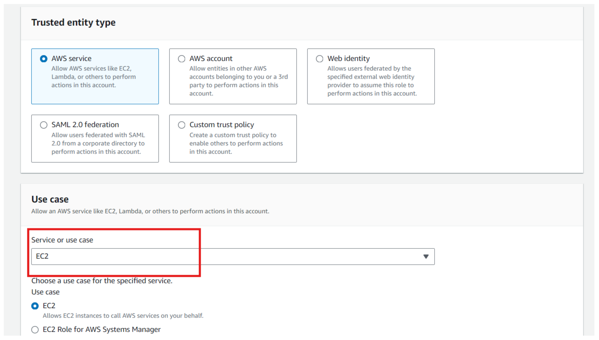
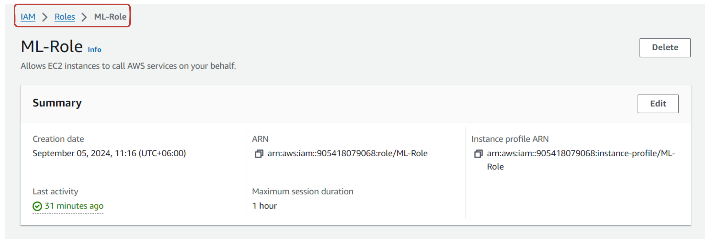
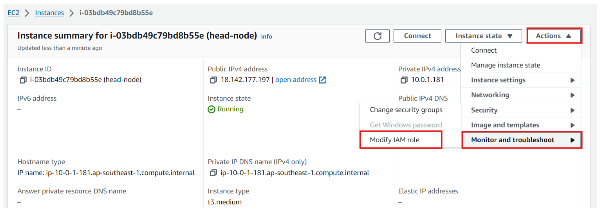
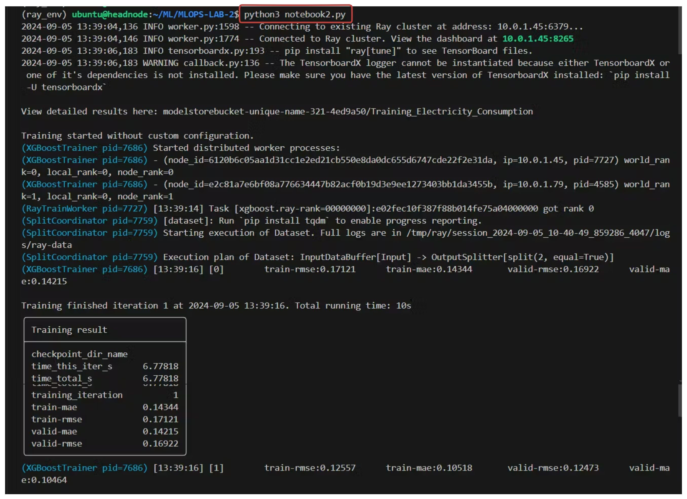
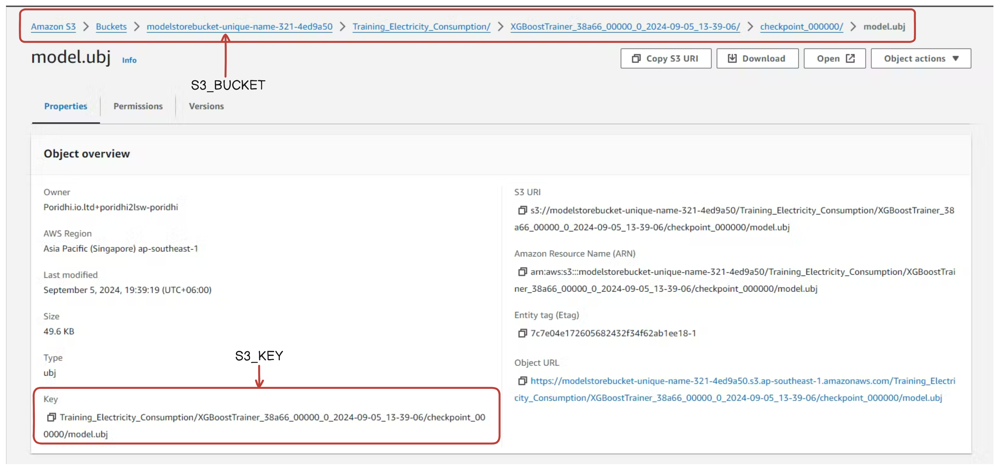
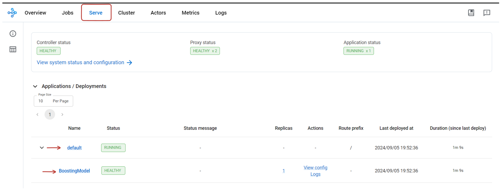
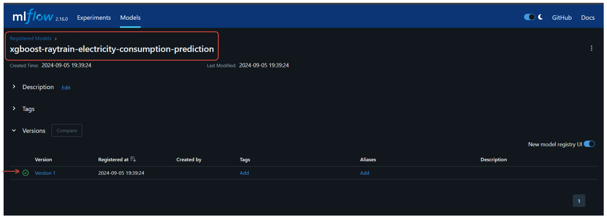
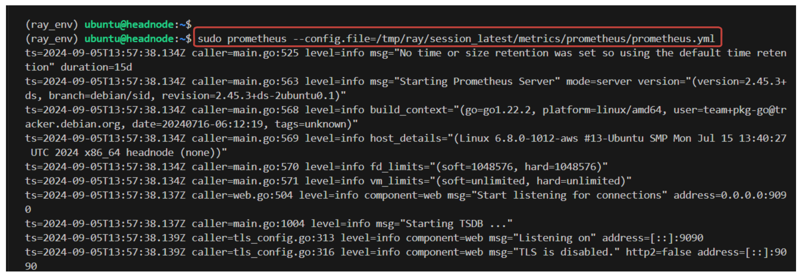
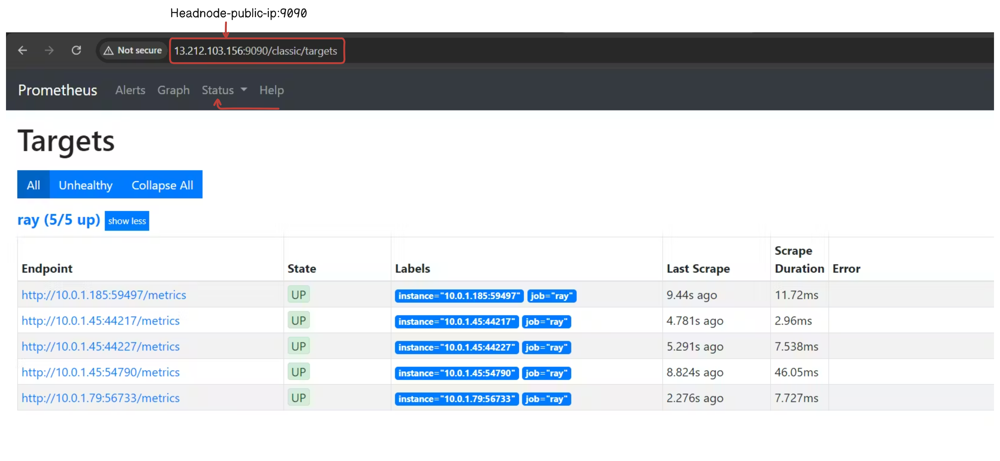
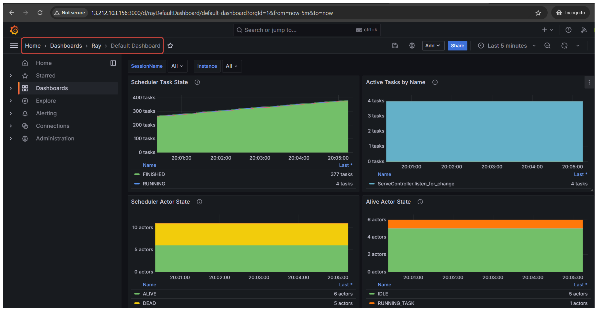

# Set up Monitoring for Ray Serve Deployment with Prometheus and Grafana

In this lab, we will explore the deployment and monitoring of a machine learning model using Ray Serve, Prometheus, and Grafana. Ray Serve is a scalable model serving library built on Ray, which allows us to deploy and serve machine learning models with ease. In this lab, we will start by setting up a Ray Serve application to deploy a trained model.

Once the model is successfully deployed, monitoring its performance and the underlying infrastructure becomes crucial. To achieve this, we will set up `Prometheus` and `Grafana` two powerful tools for **logging, monitoring, and visualizing system metrics**. Prometheus will be configured to scrape metrics from the Ray cluster, and Grafana will provide visual dashboards to help us observe the health and performance of our deployment.


By the end of this lab, you will have hands-on experience with deploying a machine learning model using Ray Serve and setting up a robust monitoring system with Prometheus and Grafana.


## Task Description

In this lab, we will:

- AWS CLI configuration
- Create AWS infrastructure (VPC, instance, S3 bucket) and automate Ray Cluster using Pulumi
- Clone the repository that contains the notebook for this lab
- Attach an IAM Role to the EC2 Instances for S3 Buckets permissions
- Run a python file for data transformation and feature store step
- Run a python file for training and saving the model
- Install and configure Prometheus and Grafana
- Monitoring the Ray serve deployment

## AWS CLI Configuration

Run the following command to configure AWS CLI:

```bash
aws configure
```

This command prompts you for your AWS Access Key ID, Secret Access Key, region, and output format.


## Set Up a Pulumi Project

### Set Up a new directory
Create a new directory for your project and navigate into it:

```sh
mkdir MLOPS-Ray-cluster
cd MLOPS-Ray-cluster
```

### Install python `venv`

```sh 
sudo apt update
sudo apt install python3.8-venv
```

### Initialize a New Pulumi Project
Run the following command to create a new Pulumi project:

```sh
pulumi new aws-python
```
Follow the prompts to set up your project.

### Create Key Pair

Create a new key pair in the `~/.ssh/` directory for the instances using the following command:

```sh
cd ~/.ssh/

aws ec2 create-key-pair --key-name key-pair-poridhi-poc --query 'KeyMaterial' --output text > key-pair-poridhi-poc.pem

chmod 400 key-pair-poridhi-poc.pem
```


### Write the scripts

1. Open a directory named `scripts`

```sh
mkdir scripts
```

2. Create a file named `head_node_user_data.txt` and add the following code to it

```sh
#!/bin/bash

# Change to the home directory
cd /home/ubuntu/

# Update the package list and install necessary software properties
sudo apt-get update
sudo apt-get install -y software-properties-common

# Add the deadsnakes PPA and install Python 3.9 and related packages
sudo add-apt-repository -y ppa:deadsnakes/ppa
sudo apt-get update
sudo apt-get install -y python3.9 python3.9-venv python3.9-dev

# Create a Python virtual environment and activate it
python3.9 -m venv ray_env
source ray_env/bin/activate

# Install Python libraries within the virtual environment
pip install boto3 pyarrow numpy pandas matplotlib seaborn plotly scikit-learn xgboost -U ipywidgets

# Install jupyter lab
pip install jupyterlab

# Install Ray and start Ray as the head node
pip install "ray[default] @ https://s3-us-west-2.amazonaws.com/ray-wheels/latest/ray-3.0.0.dev0-cp39-cp39-manylinux2014_x86_64.whl"

# Install ray server
pip install "ray[serve]"

# Install py-ubjson
pip install py-ubjson

# Install modin-ray
pip install modin[ray]

# Install mlflow
pip install mlflow

# Install missingno
pip install missingno

ray start --head --port=6379 --dashboard-host=0.0.0.0 --dashboard-port=8265 --include-dashboard=True

# Check Ray's status
ray status
```
3. Create a file named `worker_node_common_data.txt` and add the following code to it

```sh
#!/bin/bash

cd /home/ubuntu/

# Update the package list and install necessary software properties
sudo apt-get update
sudo apt-get install -y software-properties-common

# Add the deadsnakes PPA and install Python 3.9 and related packages
sudo add-apt-repository -y ppa:deadsnakes/ppa
sudo apt-get update
sudo apt-get install -y python3.9 python3.9-venv python3.9-dev

# Create a Python virtual environment and activate it
python3.9 -m venv ray_env
source ray_env/bin/activate

# Install Python libraries within the virtual environment
pip install boto3 pyarrow numpy pandas matplotlib seaborn plotly scikit-learn xgboost -U ipywidgets

# Install jupyter lab
pip install jupyterlab

# Install Ray and start Ray as the head node
pip install "ray[default] @ https://s3-us-west-2.amazonaws.com/ray-wheels/latest/ray-3.0.0.dev0-cp39-cp39-manylinux2014_x86_64.whl"

# Install ray server
pip install "ray[serve]"

# Install py-ubjson
pip install py-ubjson

# Install modin-ray
pip install modin[ray]

# Install mlflow
pip install mlflow

# Install missingno
pip install missingno
```


### Edit the pulumi code in `__main__.py` file:

```py
import pulumi
import pulumi_aws as aws
import os

# Create a VPC
vpc = aws.ec2.Vpc("micro-vpc",
    cidr_block="10.0.0.0/16",
    enable_dns_support=True,
    enable_dns_hostnames=True
)

# Create an Internet Gateway
internet_gateway = aws.ec2.InternetGateway("micro-igw",
    vpc_id=vpc.id
)

# Create a Public Subnet
subnet = aws.ec2.Subnet("micro-subnet",
    vpc_id=vpc.id,
    cidr_block="10.0.1.0/24",
    map_public_ip_on_launch=True
)

# Create a route table
route_table = aws.ec2.RouteTable("micro-route-table",
    vpc_id=vpc.id,
    routes=[aws.ec2.RouteTableRouteArgs(
        cidr_block="0.0.0.0/0",
        gateway_id=internet_gateway.id,
    )]
)

# Associate the subnet with the route table
route_table_association = aws.ec2.RouteTableAssociation("micro-route-table-association",
    subnet_id=subnet.id,
    route_table_id=route_table.id
)

# Security Group allowing SSH and HTTP
security_group = aws.ec2.SecurityGroup("micro-sec-group",
    vpc_id=vpc.id,
    description="Allow SSH and HTTP",
    ingress=[
        aws.ec2.SecurityGroupIngressArgs(
            protocol="tcp",
            from_port=22,
            to_port=22,
            cidr_blocks=["0.0.0.0/0"],
        ),
        aws.ec2.SecurityGroupIngressArgs(
            protocol="tcp",
            from_port=80,
            to_port=80,
            cidr_blocks=["0.0.0.0/0"],
        ),
        aws.ec2.SecurityGroupIngressArgs(
            protocol="tcp",
            from_port=443,
            to_port=443,
            cidr_blocks=["0.0.0.0/0"],
        ),
        aws.ec2.SecurityGroupIngressArgs(
            protocol='tcp',
            from_port=6379,
            to_port=6382,
            cidr_blocks=['0.0.0.0/0'],  # Allow from anywhere
        ),
        aws.ec2.SecurityGroupIngressArgs(
            protocol='tcp',
            from_port=1024,
            to_port=65535,
            cidr_blocks=['0.0.0.0/0'],
        ),
    ],
    egress=[
        aws.ec2.SecurityGroupEgressArgs(
            protocol="-1",
            from_port=0,
            to_port=0,
            cidr_blocks=["0.0.0.0/0"],
        ),
    ],
)

# Read the head_node_user_data.txt file. Update your path accordingly
with open('/root/code/scripts/head_node_user_data.txt', 'r') as file:
    head_node_user_data = file.read()

# Create the head node
head_node = aws.ec2.Instance('head-node',
    instance_type='t3.medium',
    ami='ami-01811d4912b4ccb26',
    vpc_security_group_ids=[security_group.id],
    subnet_id=subnet.id,
    user_data=head_node_user_data, # pass the head-node-user-data
    key_name='key-pair-poridhi-poc',
    ebs_block_devices=[
        aws.ec2.InstanceEbsBlockDeviceArgs(
            device_name="/dev/sda1",
            volume_type="gp3",
            volume_size=20,
            delete_on_termination=True,
        ),
    ],
    tags={
      'Name': 'head-node',
    }
)

# Read the worker_node_common_data.txt user. Update your path accordingly
with open('/root/code/scripts/worker_node_common_data.txt', 'r') as file:
    worker_node_common_data = file.read()


# Create worker nodes
worker_nodes = []
for i in range(2):
    worker_node_user_data = head_node.private_ip.apply(lambda ip: worker_node_common_data  + f"""
ray start --address='{ip}:6379'
""") # The private IP of the head node is passed dynamically to the worker nodes, so they can connect to the head node via Ray (ray start command).
    worker_node = aws.ec2.Instance(f'worker-node-{i+1}',
        instance_type='t3.small',
        ami='ami-01811d4912b4ccb26',
        vpc_security_group_ids=[security_group.id],
        subnet_id=subnet.id,
        user_data=worker_node_user_data, # pass the worker node user data
        key_name='key-pair-poridhi-poc',
        ebs_block_devices=[
            aws.ec2.InstanceEbsBlockDeviceArgs(
            device_name="/dev/sda1",
            volume_type="gp3",
            volume_size=20,
            delete_on_termination=True,
            ),
        ],
        tags={
            'Name': f'worker-node-{i+1}',
        }
    )
    worker_nodes.append(worker_node)

# Output the public and private IP addresses
pulumi.export('head_node_private_ip', head_node.private_ip)
pulumi.export('head_node_public_ip', head_node.public_ip)

# Export the worker node public and private ip
for i, worker_node in enumerate(worker_nodes):
    pulumi.export(f'worker_node_{i+1}_private_ip', worker_node.private_ip)
    pulumi.export(f'worker_node_{i+1}_public_ip', worker_node.public_ip)


# Create a dynamic config file for SSH access
def create_config_file(ip_list):
    # Define the hostnames for each IP address
    hostnames = ['headnode', 'worker1', 'worker2']
    
    config_content = ""
    
    # Iterate over IP addresses and corresponding hostnames
    for hostname, ip in zip(hostnames, ip_list):
        config_content += f"Host {hostname}\n"
        config_content += f"    HostName {ip}\n"
        config_content += f"    User ubuntu\n"
        config_content += f"    IdentityFile ~/.ssh/key-pair-poridhi-poc.pem\n\n"
    
    # Write the content to the SSH config file
    config_path = os.path.expanduser("~/.ssh/config")
    with open(config_path, "w") as config_file:
        config_file.write(config_content)

# Collect the IPs for all nodes
all_ips = [head_node.public_ip] + [worker_node.public_ip for worker_node in worker_nodes]

# Create the config file with the IPs once the instances are ready
pulumi.Output.all(*all_ips).apply(create_config_file)


# Create Staging S3 bucket with unique names
staging_data_store_bucket = aws.s3.Bucket("stagingdatastorebucket-unique-name-321",
    acl="private",  # Example ACL configuration
    versioning=aws.s3.BucketVersioningArgs(
        enabled=True,
    ),
)

# Create Feature store bucket
feature_store_bucket = aws.s3.Bucket("featurestorebucket-unique-name-321",
    acl="private",  # Example ACL configuration
    versioning=aws.s3.BucketVersioningArgs(
        enabled=True,
    ),
)

# Create Model store bucket
model_store_bucket = aws.s3.Bucket("modelstorebucket-unique-name-321",
    acl="private",  # Example ACL configuration
    versioning=aws.s3.BucketVersioningArgs(
        enabled=True,
    ),
)

# Create Results store bucket
results_store_bucket = aws.s3.Bucket("resultsstorebucket-unique-name-321",
    acl="private",  # Example ACL configuration
    versioning=aws.s3.BucketVersioningArgs(
        enabled=True,
    ),
)

# Export the names of the created buckets
pulumi.export('staging_data_store_bucket_name', staging_data_store_bucket.id)
pulumi.export('feature_store_bucket_name', feature_store_bucket.id)
pulumi.export('model_store_bucket_name', model_store_bucket.id)
pulumi.export('results_store_bucket_name', results_store_bucket.id)
```

### Deploy the Pulumi Stack

Deploy the stack using the following command:

```sh
pulumi up
```
Review the changes and confirm by typing `yes`.

### Check the Ray Status on the Head Node

1. **SSH into the Head Node:**

   First, log into the head node using SSH.

   ```sh
   ssh headnode
   ```

2. **Check Ray Cluster Status:**

   After logging in, run the following command to check the status of the Ray cluster:

   ```sh
   ray status
   ```
   

   > **Note:** It may take a few minutes for all nodes to connect and the cluster to become fully operational after deployment. Be patient while the system initializes.


## Change File Ownership and Permissions

In some cases, certain directories or files may have restricted permissions or be owned by the `root` user, which can interfere with the smooth operation of Ray or cause permission-related issues. To prevent this, adjust the ownership and permissions as follows:

1. **Change Ownership of the Ray Environment Directory:**

   To change ownership of the Ray environment directory to the `ubuntu` user, run the following command:

   ```sh
   sudo chown -R ubuntu:ubuntu /home/ubuntu/ray_env
   ```

   This command recursively modifies the ownership of all files and directories under `/home/ubuntu/ray_env`, ensuring the `ubuntu` user has full control.

2. **Change Ownership of the Ray Temporary Files:**

   Similarly, you may also need to adjust the ownership of the Ray-related files in the `/tmp/ray` directory. Run:

   ```sh
   sudo chown -R ubuntu:ubuntu /tmp/ray/*
   ```

    

   This ensures the `ubuntu` user has the necessary permissions to manage Ray processes, which often store temporary files in this location.

## Attach an IAM Role to the EC2 Instances for S3 Buckets permissions

Let’s create an IAM role with the necessary permissions for EC2 instances to write to our S3 buckets.

### Create an IAM Role

- Go to the IAM console and create a new role.
- Select trusted entity type as `AWS service` and usecase as `EC2` as we are creating the role for EC2 instances.

    

- Give a name to the role and click `Create role`.

    

### Attach Policy for Permissions

- On the role summary page, under the "Permissions" tab, click on the "Add permissions" button.
- Choose `Create inline policy`.

    

- Attach the following `json` file in the policy editor:

    ```json
    {
        "Version": "2012-10-17",
        "Statement": [
            {
                "Effect": "Allow",
                "Action": [
                    "s3:PutObject",
                    "s3:GetObject",
                    "s3:GetObjectVersion",
                    "s3:ListBucket",
                    "s3:ListBucketVersions"
                ],
                "Resource": [
                    "arn:aws:s3:::stagingdatastorebucket-unique-name-321-bf73fa4",
                    "arn:aws:s3:::stagingdatastorebucket-unique-name-321-bf73fa4/staging-directory/*",
                    "arn:aws:s3:::featurestorebucket-unique-name-321-0c6657a",
                    "arn:aws:s3:::featurestorebucket-unique-name-321-0c6657a/*",
                    "arn:aws:s3:::modelstorebucket-unique-name-321-9847f67",
                    "arn:aws:s3:::modelstorebucket-unique-name-321-9847f67/*",
                    "arn:aws:s3:::resultsstorebucket-unique-name-321-0876e55",
                    "arn:aws:s3:::resultsstorebucket-unique-name-321-0876e55/*"
                ]
            }
        ]
    }
    ```
    Replace the bucket names with your actual bucket names.

  

### Attach the Role to EC2 instances

- Go to the EC2 Dashboard.
- Select the instances you created (`headnode`, `worker1`, `worker2`), to attach the role.
- Click on Actions > Security > Modify IAM Role.

    

- In the dropdown list, you should see the role you created. Select it and click `Update IAM Role`.

    

- Repeat these steps for worker nodes also.


## Run MLflow

1. SSH into `headnode` and activate `ray_env`. Run the following command to start **MLflow** dashboard:

    ```
    mlflow ui --host 0.0.0.0 --port 5000
    ```
2. Go to the browser and paste this URL

    ```
    http://<headnode-public-ip>:5000
    ```
3. You should see the **MLflow** dashboard.

    


## Run the first notebook using python file

Go to this directory to continue:

```bash
cd ML
cd MLOPS-LAB-2
```

Create a file `notebook1.py` and edit as follows:

```python
import os
import boto3
import pandas as pd
from dotenv import load_dotenv
import ray
from sklearn.preprocessing import MinMaxScaler

# Load environment variables from .env file
load_dotenv()

# Retrieve environment variables
aws_access_key_id = os.getenv('AWS_ACCESS_KEY_ID')
aws_secret_access_key = os.getenv('AWS_SECRET_ACCESS_KEY')
aws_region = os.getenv('AWS_REGION')
source_bucket_name = os.getenv('SOURCE_BUCKET_NAME')
destination_bucket_name = os.getenv('DESTINATION_BUCKET_NAME')
local_file_path = os.getenv('LOCAL_FILE_PATH')
file_key = 'staging-directory/raw-dataset.csv'

# Ensure the variables are correctly set
if not all([aws_access_key_id, aws_secret_access_key, aws_region, source_bucket_name, destination_bucket_name, local_file_path]):
    raise ValueError("One or more environment variables are not set correctly.")

# Create an S3 resource
s3_client = boto3.resource(
    service_name='s3',
    region_name=aws_region,
    aws_access_key_id=aws_access_key_id,
    aws_secret_access_key=aws_secret_access_key
)

# Upload file to S3
print(f"Uploading file {local_file_path} to bucket {source_bucket_name} with key {file_key}...")
s3_client.meta.client.upload_file(local_file_path, source_bucket_name, file_key)

# List all objects in the bucket
print(f"Objects in bucket {source_bucket_name}:")
for obj in s3_client.Bucket(source_bucket_name).objects.all():
    print(obj.key)

# Read dataset from S3
ds = ray.data.read_csv(f"s3://{source_bucket_name}/{file_key}")
ds.show(limit=5)
df = ds.to_pandas()

# Define batch transformer
class BatchTransformer:
    def __init__(self):
        pass

    @staticmethod
    def categorize_time_of_day(hour):
        if 6 <= hour < 12:
            return 'Morning'
        elif 12 <= hour < 18:
            return 'Afternoon'
        elif 18 <= hour < 24:
            return 'Evening'
        else:
            return 'Night'

    @staticmethod
    def categorize_season(month):
        if month in [12, 1, 2]:
            return 'Winter'
        elif month in [3, 4, 5]:
            return 'Spring'
        elif month in [6, 7, 8]:
            return 'Summer'
        else:
            return 'Autumn'

    def transform(self, batch):
        batch['Datetime'] = pd.to_datetime(batch['Datetime'])
        batch['Year'] = batch['Datetime'].dt.year
        batch['Month'] = batch['Datetime'].dt.month
        batch['Day'] = batch['Datetime'].dt.day
        batch['Hour'] = batch['Datetime'].dt.hour
        batch['TimeOfDay'] = batch['Hour'].apply(self.categorize_time_of_day)
        batch['Weekday'] = batch['Datetime'].dt.weekday
        batch['IsWeekend'] = batch['Weekday'].apply(lambda x: 1 if x >= 5 else 0)
        batch['Season'] = batch['Month'].apply(self.categorize_season)
        batch['Year'] = batch['Year'].astype(int)
        batch['Weekday'] = batch['Weekday'].astype(int)
        batch['IsWeekend'] = batch['IsWeekend'].astype(int)
        return batch

# Instantiate the transformer and apply it to the dataset
transformer = BatchTransformer()
transformed_ds = ds.map_batches(transformer.transform, batch_format="pandas")
transformed_ds.to_pandas()

# Drop unnecessary columns
ds_updated = transformed_ds.drop_columns(["Datetime"])
df_updated = ds_updated.to_pandas()

# Define function to encode categorical columns
def encode_categorical_columns(batch):
    categorical_columns = ['TimeOfDay', 'Season']
    batch_encoded = pd.get_dummies(batch, columns=categorical_columns)
    batch_encoded = batch_encoded.astype(int)
    return batch_encoded

# Apply one-hot encoding
ds_encoded = ds_updated.map_batches(encode_categorical_columns, batch_format="pandas")
df_encoded = ds_encoded.to_pandas()

# Define aggregation functions and perform grouping
aggregation_functions = {
    'Temperature': ['mean'],
    'Humidity': ['mean'],
    'WindSpeed': ['mean'],
    'GeneralDiffuseFlows': ['mean'],
    'DiffuseFlows': ['mean'],
    'PowerConsumption_Zone1': ['sum'],
    'PowerConsumption_Zone2': ['sum'],
    'PowerConsumption_Zone3': ['sum'],
    'Weekday': ['first'],
    'IsWeekend': ['first'],
    'TimeOfDay_Afternoon': ['first'],
    'TimeOfDay_Evening': ['first'],
    'TimeOfDay_Morning': ['first'],
    'TimeOfDay_Night': ['first'],
    'Season_Autumn': ['first'],
    'Season_Spring': ['first'],
    'Season_Summer': ['first'],
    'Season_Winter': ['first']
}

df_grouped = df_encoded.groupby(['Year', 'Month', 'Day', 'Hour']).agg(aggregation_functions)
df_grouped.columns = ['_'.join(col) if isinstance(col, tuple) else col for col in df_grouped.columns]
df_grouped = df_grouped.reset_index()

# Create lag features
columns_to_lag = [
    'Temperature_mean', 'Humidity_mean', 'WindSpeed_mean', 'GeneralDiffuseFlows_mean',
    'DiffuseFlows_mean', 'PowerConsumption_Zone1_sum', 'PowerConsumption_Zone2_sum',
    'PowerConsumption_Zone3_sum'
]

lags = [4, 8, 12, 24, 48]
df_lagged = df_grouped.copy()

for col in columns_to_lag:
    for lag in lags:
        df_lagged[f'{col}_lag{lag}'] = df_grouped[col].shift(lag)

df_lagged.fillna(0, inplace=True)
df_lagged = df_lagged.dropna()

# Convert to Ray Dataset and scale
feature_ds = ray.data.from_pandas(df_lagged)
cols_to_scale = [
    "Temperature_mean", "Humidity_mean", "WindSpeed_mean",
    "GeneralDiffuseFlows_mean", "DiffuseFlows_mean", "PowerConsumption_Zone1_sum", 
    "PowerConsumption_Zone2_sum", "PowerConsumption_Zone3_sum",
    "Temperature_mean_lag4", "Temperature_mean_lag8", "Temperature_mean_lag12", "Temperature_mean_lag24", "Temperature_mean_lag48",
    "Humidity_mean_lag4", "Humidity_mean_lag8", "Humidity_mean_lag12", "Humidity_mean_lag24", "Humidity_mean_lag48",
    "WindSpeed_mean_lag4", "WindSpeed_mean_lag8", "WindSpeed_mean_lag12", "WindSpeed_mean_lag24", "WindSpeed_mean_lag48",
    "GeneralDiffuseFlows_mean_lag4", "GeneralDiffuseFlows_mean_lag8", "GeneralDiffuseFlows_mean_lag12", "GeneralDiffuseFlows_mean_lag24", "GeneralDiffuseFlows_mean_lag48",
    "DiffuseFlows_mean_lag4", "DiffuseFlows_mean_lag8", "DiffuseFlows_mean_lag12", "DiffuseFlows_mean_lag24", "DiffuseFlows_mean_lag48",
    "PowerConsumption_Zone1_sum_lag4", "PowerConsumption_Zone1_sum_lag8", "PowerConsumption_Zone1_sum_lag12", "PowerConsumption_Zone1_sum_lag24", "PowerConsumption_Zone1_sum_lag48",
    "PowerConsumption_Zone2_sum_lag4", "PowerConsumption_Zone2_sum_lag8", "PowerConsumption_Zone2_sum_lag12", "PowerConsumption_Zone2_sum_lag24", "PowerConsumption_Zone2_sum_lag48",
    "PowerConsumption_Zone3_sum_lag4", "PowerConsumption_Zone3_sum_lag8", "PowerConsumption_Zone3_sum_lag12", "PowerConsumption_Zone3_sum_lag24", "PowerConsumption_Zone3_sum_lag48"
]

def scale_partition(df, cols_to_scale):
    scaler = MinMaxScaler()
    df[cols_to_scale] = scaler.fit_transform(df[cols_to_scale])
    return df

scaled_ds = feature_ds.map_batches(lambda batch: scale_partition(batch, cols_to_scale), batch_format="pandas")
scaled_df = scaled_ds.to_pandas()

# Save transformed data to CSV and upload to S3
scaled_df.to_csv('2-transformed-data/transformed_features.csv', index=False)
scaled_ds.write_csv(f"s3://{destination_bucket_name}/feature_data.csv")

print("Data processing and upload complete.")
```

Create a file `notebook2.py` and edit as follows:
```python
import os
import boto3
import ray
import pandas as pd
import matplotlib.pyplot as plt
import xgboost as xgb
from sklearn.model_selection import train_test_split
from ray import train
from ray.train import ScalingConfig
from ray.train.xgboost import XGBoostTrainer
import mlflow
from ray.air.integrations.mlflow import MLflowLoggerCallback
from dotenv import load_dotenv

# Load environment variables
load_dotenv()

# Set up S3 client
s3_client = boto3.client(
    service_name='s3',
    region_name='ap-southeast-1',
    aws_access_key_id=os.getenv('AWS_ACCESS_KEY_ID'),
    aws_secret_access_key=os.getenv('AWS_SECRET_ACCESS_KEY')
)

# Download file from S3
bucket_name = os.getenv('S3_BUCKET_NAME')
file_key = os.getenv('S3_FILE_KEY')
version_id = os.getenv('S3_VERSION_ID')
local_file_path = "3-training-data/training_features.csv"
s3_client.download_file(bucket_name, file_key, local_file_path, ExtraArgs={"VersionId": version_id})

# Load data
df_lagged = pd.read_csv(local_file_path)

# Prepare data for training
X = df_lagged.drop(['PowerConsumption_Zone1_sum', 'PowerConsumption_Zone2_sum', 'PowerConsumption_Zone3_sum'], axis=1)
y1 = df_lagged['PowerConsumption_Zone1_sum']
df_combined = X.copy()
df_combined['label'] = y1 
df_train, df_valid = train_test_split(df_combined, test_size=0.2, random_state=42)
train_dataset = ray.data.from_pandas(df_train)
valid_dataset = ray.data.from_pandas(df_valid)

# XGBoost parameters
xgb_params = {
    "objective": "reg:squarederror",
    "eval_metric": ["rmse", "mae"],
}

# Ray trainer configuration
scaling_config = ScalingConfig(num_workers=2, use_gpu=False)
mlflow_tracking_uri = os.getenv('MLFLOW_TRACKING_URI')

trainer = XGBoostTrainer(
    scaling_config=scaling_config,
    label_column="label",
    params=xgb_params,
    datasets={"train": train_dataset, "valid": valid_dataset},
    run_config=train.RunConfig(
        storage_path=os.getenv('MODEL_STORAGE_PATH'),
        name="Training_Electricity_Consumption",
        callbacks=[
            MLflowLoggerCallback(
                tracking_uri=mlflow_tracking_uri,
                experiment_name="mlflow_callback_ray",
                save_artifact=True,
            )
        ],
    )
)
result = trainer.fit()

model = trainer.get_model(result.checkpoint)

# Log model with MLflow
mlflow.set_tracking_uri(mlflow_tracking_uri)
mlflow.set_experiment("mlflow_callback_ray")

mlflow.xgboost.log_model(
    xgb_model=model,
    artifact_path="electricity-consumption-prediction",
    registered_model_name="xgboost-raytrain-electricity-consumption-prediction",
)

# Save model locally
import pickle
with open('latest-model.pkl', 'wb') as file:
    pickle.dump(model, file)

# Log dataset info
import tempfile
import json

def log_dataset_info(train_dataset, valid_dataset, experiment_name="mlflow_callback_ray"):
    mlflow.set_tracking_uri(mlflow_tracking_uri)
    mlflow.set_experiment(experiment_name)
    train_df = train_dataset.to_pandas()
    valid_df = valid_dataset.to_pandas()
    
    train_stats = {
        'num_samples': len(train_df),
        'feature_columns': list(train_df.columns),
    }
    valid_stats = {
        'num_samples': len(valid_df),
        'feature_columns': list(valid_df.columns),
    }

    with tempfile.NamedTemporaryFile(mode="w", delete=False, suffix=".json") as tmp:
        json.dump(train_stats, tmp)
        mlflow.log_artifact(tmp.name, "train_dataset_info")
    with tempfile.NamedTemporaryFile(mode="w", delete=False, suffix=".json") as tmp:
        json.dump(valid_stats, tmp)
        mlflow.log_artifact(tmp.name, "valid_dataset_info")

    sample_file = tempfile.NamedTemporaryFile(delete=False, suffix=".csv").name
    train_df.head(100).to_csv(sample_file)
    mlflow.log_artifact(sample_file, "dataset_samples")

log_dataset_info(train_dataset, valid_dataset)

# Sample prediction
sample_request_input = {
    "Year": 2020,
    "Month": 7,
    "Day": 14,
    "Hour": 15,
    "Temperature_mean": 25.5,
    "Humidity_mean": 30,
    "WindSpeed_mean": 5,
    "GeneralDiffuseFlows_mean": 200,
    "DiffuseFlows_mean": 180,
    "Weekday_first": 1,
    "IsWeekend_first": 0,
    "TimeOfDay_Afternoon_first": 1,
    "TimeOfDay_Evening_first": 0,
    "TimeOfDay_Morning_first": 0,
    "TimeOfDay_Night_first": 0,
    "Season_Autumn_first": 0,
    "Season_Spring_first": 0,
    "Season_Summer_first": 1,
    "Season_Winter_first": 0,
    "Temperature_mean_lag4": 25.0,
    "Temperature_mean_lag8": 24.5,
    "Temperature_mean_lag12": 24.0,
    "Temperature_mean_lag24": 23.5,
    "Temperature_mean_lag48": 23.0,
    "Humidity_mean_lag4": 35,
    "Humidity_mean_lag8": 40,
    "Humidity_mean_lag12": 45,
    "Humidity_mean_lag24": 50,
    "Humidity_mean_lag48": 55,
    "WindSpeed_mean_lag4": 4,
    "WindSpeed_mean_lag8": 4.5,
    "WindSpeed_mean_lag12": 5,
    "WindSpeed_mean_lag24": 5.5,
    "WindSpeed_mean_lag48": 6,
    "GeneralDiffuseFlows_mean_lag4": 190,
    "GeneralDiffuseFlows_mean_lag8": 180,
    "GeneralDiffuseFlows_mean_lag12": 170,
    "GeneralDiffuseFlows_mean_lag24": 160,
    "GeneralDiffuseFlows_mean_lag48": 150,
    "DiffuseFlows_mean_lag4": 170,
    "DiffuseFlows_mean_lag8": 160,
    "DiffuseFlows_mean_lag12": 150,
    "DiffuseFlows_mean_lag24": 140,
    "DiffuseFlows_mean_lag48": 130,
    "PowerConsumption_Zone1_sum_lag4": 1000,
    "PowerConsumption_Zone1_sum_lag8": 1050,
    "PowerConsumption_Zone1_sum_lag12": 1100,
    "PowerConsumption_Zone1_sum_lag24": 1150,
    "PowerConsumption_Zone1_sum_lag48": 1200,
    "PowerConsumption_Zone2_sum_lag4": 2000,
    "PowerConsumption_Zone2_sum_lag8": 2050,
    "PowerConsumption_Zone2_sum_lag12": 2100,
    "PowerConsumption_Zone2_sum_lag24": 2150,
    "PowerConsumption_Zone2_sum_lag48": 2200,
    "PowerConsumption_Zone3_sum_lag4": 3000,
    "PowerConsumption_Zone3_sum_lag8": 3050,
    "PowerConsumption_Zone3_sum_lag12": 3100,
    "PowerConsumption_Zone3_sum_lag24": 3150,
    "PowerConsumption_Zone3_sum_lag48": 3200,
}
sample_df = pd.DataFrame.from_dict([sample_request_input])
sample_df.shape
data_dmatrix = xgb.DMatrix(sample_df)
predictions = model.predict(data=data_dmatrix)

# Print predictions
print(predictions)

# Predictions on test data
prediction_dataframe = pd.read_csv("./3-training-data/training_features.csv")

prediction_dataframe_dropped = prediction_dataframe.drop(['PowerConsumption_Zone1_sum', 'PowerConsumption_Zone2_sum', 'PowerConsumption_Zone3_sum'], axis=1)
df_valid_features = df_valid.drop('label', axis=1)
data_dmatrix = xgb.DMatrix(df_valid_features)
predictions = model.predict(data=data_dmatrix)

# Print test data predictions
print(predictions)
```


### Create a file for environment variables

- Create and open a `.env` file and change the following environment variables according to your configuration:

    ```env
    AWS_ACCESS_KEY_ID=<aws-access-key-id>
    AWS_SECRET_ACCESS_KEY=<aws-secret-access-key>
    AWS_REGION=ap-southeast-1
    SOURCE_BUCKET_NAME=<stagingdatastorebucket-unique-name-321-ab816c6>
    DESTINATION_BUCKET_NAME=<featurestorebucket-unique-name-321-e5e92dd>
    LOCAL_FILE_PATH=./1-raw-dataset/powerconsumption.csv
    S3_BUCKET_NAME=<featurestorebucket-unique-name-321-e5e92dd>
    S3_FILE_KEY=<feature_data.csv/6_000000_000000.csv>
    S3_VERSION_ID=<84UkDa05Q4PxXeRcDXkbV9otLciYspl4>
    MLFLOW_TRACKING_URI=http://head-node-public-ip:5000
    MODEL_STORAGE_PATH=<s3://modelstorebucket-unique-name-321-4ed9a50/>
    ```

    

### Run the python file

Run the first python file using the following command:

```bash
python3 notebook1.py
```

Run the second python file:

```sh
python3 notebook2.py
```



## Set up Ray Serve Application for Serving the Model

1. Go to the `MLOPS-LAB-3` directory of the cloned repository.
2. Edit the `xgboost_test_s3actions.py` file.

    

3. Edit the marked portion of the code according to your values.

    - Relplace the `S3_BUCKET` name.
    - Replace the `S3_FILE_KEY` name.

    

    - You will find the values in the AWS S3 Bucket console.

    

4. Deploy the ray application which possesses the trained model with the following command

    ```sh
    sudo -E $(which serve) run xgboost_test_s3actions:boosting_model
    ```

    You will get a output like this, showing the successfull deployment of the app.

    

5. Go to the `Ray Dashboard > Serve`, and check the deployed app status

    


## Open MLflow dashboard 

After completly running the python scripts for, open the MLflow dashboard to see the Experiment Tracking:

- MLFlow provides experiment tracking, allowing you to monitor the training process, log metrics, and manage model versions. It is crucial for experiment reproducibility and performance evaluation.

    

- Check the Registered Models.

    

## Setting up Prometheus:

1. **Install Prometheus**

    ```sh
    sudo apt update
    sudo apt install prometheus -y
    ```

2. **Run the Prometheus server:**

    Run the Prometheus server with the configuration file given in the ray session file where the metrics export ports are defined

    ```sh
    sudo prometheus --config.file=/tmp/ray/session_latest/metrics/prometheus/prometheus.yml
    ```
    

3. If you see any `address already in use` error:

    
    
    You can kill the process using the following command:

    ```sh
    sudo ls-f -i :9090
    sudo kill PID
    ```

    

4. Go to the prometheus dashboard

    ```sh
    http://headnode-public-ip:9090
    ```
    If you go the Status → Targets, you would find the target endpoints which are referring to the metrices exported by Ray cluster and its components like the model we have deployed.

    

## Setting up Grafana for Visualizing the Metrices

Grafana will be used to visualize the model and system metrices like the cluster utilization, node memory, node disk IO, note CPU, note network etc.

1. At first, download and install Grafana to your head node using the following commands

    ```sh
    sudo apt-get install -y adduser libfontconfig1 musl
    wget https://dl.grafana.com/enterprise/release/grafana-enterprise_11.2.0_amd64.deb
    sudo dpkg -i grafana-enterprise_11.2.0_amd64.deb
    ```
2. After installation, run the following command to change the ownership to acccess the bin

    ```sh
    sudo chown -R ubuntu:ubuntu /usr/share/grafana 
    ```
3. Start the Grafana Server with the Ray Cluster Config

    ```sh
    /usr/sbin/grafana-server --homepath=/usr/share/grafana --config=/tmp/ray/session_latest/metrics/grafana/grafana.ini web
    ```

    

4. Now go to the Grafana Dashboard

    ```sh
    http://headnode-public-ip:3000
    ```

    Log in to the Grafana Dashboard using the credentials

    ```sh
    username: admin
    passoword: admin
    ```

    

5. You will see all the necessary metrics about the components of the Ray Cluster are visualized in the default dashboard.

    


## Test Out the Deployment and Clean Up

- Stopping the ray cluster

    ```sh
    ray stop
    ```

- Destroy the PULUMI stack

    ```sh
    pulumi destroy
    ```

