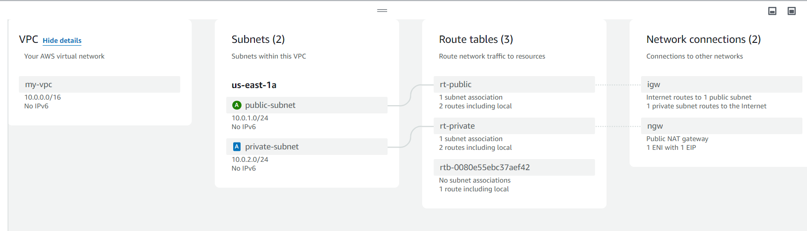

# Nginx Layer 4 weighted Load Balancing on NodeJS-MySQL App in AWS

This document outlines the process of setting up a `layer 4` load-balanced Node.js application environment using Nginx. The setup consists of two identical Node.js applications, an `Nginx` server for weighted load balancing and health checkup. We will use `mysql` database for this app. We will also deploy it in AWS.


## Task
Create a load-balanced environment with two `Node.js` applications, `Nginx` as a layer 4 load balancer with weighting parameter and health checkup, and a `MySQL` database, all running in AWS EC2 instance.


## Steps

### Setup AWS: Create VPC, subnets, route table and gateways 

At first, we need to create a VPC in AWS, configure subnet, route tables and gateway.

1. Create a VPC named `my-vpc`
2. Create 2 subnets `public-subnet` and `private-subnet`.
3. Create a public route table named `rt-public` and associate it with `public-subnet`.
4. Create a private route table named `rt-private` and associate it with `private-subnet`
5. Create an internet gateway named `igw` and attach it to `my-vpc`.
6. Create a NAT gateway named `nat-gw` and associate it with `public-subnet`.
7. Configure the route tables to use the internet gateway and NAT gateway.

Here is the `resource-map` of our VPC:

<!--  -->



### Create and setup EC2 instances

We need to create `3 instances` in EC2. One in the public subnet for `nginx` server, rest two is for two Nodejs Application. Both will be in the private subnet.

#### Create the NodeJS App EC2 Instances:
- Launch two EC2 instances (let's call them `node-app-1` and `node-app-2`) in our private subnet.
- Choose an appropriate AMI (e.g., Ubuntu).
- Configure the instances with necessary security group rules to allow HTTP/HTTPS traffic (typically port 80/443).
- Assign a key pair for SSH access.

#### Create the NGINX EC2 Instance:
- Launch another EC2 instance for the NGINX load balancer (let's call it `nginx-lb`) in our public subnet.
- Configure the instance with a security group to allow incoming traffic on the load balancer port (typically port 80/443) and outgoing traffic to the NodeJS servers.
- Assign a key pair e.g. <MyKeyPair.pem> for SSH access.

#### Create the mysql EC2 Instance:
- Launch another EC2 instance for the MySQL Database (let's call it `mysql`).


### Access the Public Instance via SSH

1. *Set File Permissions*:

   - *For Linux*:
     ```sh
     chmod 400 <MyKeyPair.pem>
     ```

2. *SSH into the Public Instance*:
   - Open a terminal and run:
     ```sh
     ssh -i MyKeyPair.pem ubuntu@<public_instance_ip>
     ```
   - Replace <public_instance_ip> with the public IP address of the public instance.

#### Copy the Key Pair to the Public Instance

3. *Copy the Key Pair to the Public Instance*:
   - On your local machine, run the following command to copy the key pair to the public instance:
     ```sh
     scp -i <MyKeyPair.pem> <MyKeyPair.pem> ubuntu@<public_instance_ip>:~
     ```
   - Replace <public_instance_ip> with the public IP address of the public instance.

#### SSH from the Public Instance to the Private Instance

3. *SSH into the Private Instance from the Public Instance*:
   - On the public instance, change the permissions of the copied key pair:
     ```sh
     chmod 400 <MyKeyPair.pem>
     ```
   - Then, SSH into the private instance:
     ```sh
     ssh -i <MyKeyPair.pem> ubuntu@<private_instance_ip>
     ```
   - Replace <private_instance_ip> with the private IP address of the private instance.

## Set up Node.js Applications

Connect to `node-app-1` and configure as follows:

### Create Node App 1

Install npm:
```sh
sudo apt update
sudo apt install npm
```

Then, 
```bash
mkdir Node-app
cd Node-app
npm init -y
npm install express mysql2 body-parser
```

Create `index.js` in the Node-app-1 directory with the following code:

```javascript
const express = require('express');
const app = express();
const port = process.env.PORT;

app.get('/', (req, res) => {
  res.status(200).send(`Hello, from Node App on PORT: ${port}!`);
});

app.listen(port, () => {
  console.log(`App running on http://localhost:${port}`);
});
```

### Create Node App 2

Connect to the `Node-app-2` instance. 
Here, do the similar steps as `Node-app-1`.
 

### Start Node.js Applications
Navigate to each Node.js application directory and run:
For node-app-1:

```bash
export PORT=3001
node index.js
```
For node-app-2:
```bash
export PORT=3002
node index.js
```

### Install and setup NGINX:

Nginx is very easy to install if we install it from a package manager like apt on Ubuntu or yum in CentOS. It is good for a general proposed load balancer, reverse proxy, and web server. But sometimes we need additional modules to add more function to Nginx that is not included in default installation from the package manager. If that is the case, you need to install the Nginx from source. In this tutorial, we will guide you step by step on how to install Nginx from source on ubuntu.

#### Sudo Privileges
Before starting, make sure that we have no permission issue on the installation & configuration.

```bash
sudo su
```

#### Install Dependencies
Run this command to install Nginx dependencies

```bash
apt update -y && apt-get install git build-essential libpcre3 libpcre3-dev zlib1g zlib1g-dev libssl-dev libgd-dev libxml2 libxml2-dev uuid-dev
```

#### Download Nginx Source Code
Before you download the Nginx source code, you can visit http://nginx.org/en/download.html to see the Nginx version available now. After that you can download them by running this command:

```bash
wget http://nginx.org/download/nginx-<version>.tar.gz
```
Now, the latest stable version is 1.26.1, so for me, I will download the nginx-1.26.1 version

```bash
wget http://nginx.org/download/nginx-1.26.1.tar.gz
```

Extract the downloaded file

```bash
tar -zxvf nginx-1.26.1.tar.gz
```

#### Build & Install Nginx
After extract the file, go to the nginx directory

```bash
cd nginx-1.20.1
```
Now is the time to configure Nginx that suits your need, this is where you put in the module you want to include in Nginx using the ./configure command. The full documentation is in here: Building Nginx from Sources. For now, I will give you the minimum configure option so you can build a good load balancer, reverse proxy, or webserver. Run this command to configure Nginx:

```bash
./configure \
    --prefix=/etc/nginx \
    --conf-path=/etc/nginx/nginx.conf \
    --error-log-path=/var/log/nginx/error.log \
    --http-log-path=/var/log/nginx/access.log \
    --pid-path=/run/nginx.pid \
    --sbin-path=/usr/sbin/nginx \
    --with-http_ssl_module \
    --with-http_v2_module \
    --with-http_stub_status_module \
    --with-http_realip_module \
    --with-file-aio \
    --with-threads \
    --with-stream \
    --with-stream_ssl_preread_module
```

After that, run this command to build & install the Nginx

```bash
make && make install
```

To verify the installation, you can check the Nginx version

```bash
nginx -V
```

### Configure NGINX as an L4 Load Balancer

First, move to work directory to the Nginx configuration folder
```sh
cd /etc/nginx
```
Backup the default Nginx configuration file
```sh
mv nginx.conf nginx.conf.old
```
Open the NGINX configuration file.
```sh
sudo vim nginx.conf
```
**nginx.conf:**

```sh
events {}

stream {
    upstream nodejs_backend {
        # Weighted load balancing
        server <Node-app-1 private-ip>:3001 weight=3 max_fails=2 fail_timeout=10s; # Node-app-1 with higher traffic
        server <Node-app-2 private-ip>:3002 weight=1 max_fails=2 fail_timeout=10s; # Node-app-2 with less traffic

        # Shared memory zone for session persistence across worker processes
        zone backend 64k;
    }

    server {
        listen 80;

        proxy_pass nodejs_backend;

        # Enable TCP load balancing
        proxy_connect_timeout 1s;
        proxy_timeout 3s;    
    }
}
```

Replace the `pubic ip` of nodejs app according to `your ec2 instances`.

**Explanation**:
- `Weight-Based Load Balancing:` 
    Each server in the upstream block has a weight parameter. The higher the weight, the more requests are sent to that server. In this case, <Node-app-1 private-ip>:3001 has a weight of 3, and <Node-app-2 private-ip>:3002 has a weight of 1.

This configuration provides a simple weighted round-robin load balancing with a healthcheckup across our Node.js applications at the TCP level, which can be more efficient than HTTP-level load balancing for certain use cases.


## Verification

1. Visit `http://<nginx-public-ip>` in a web browser. You should see a response from one of the Node.js applications.

2. Refresh the browser or make multiple requests to observe the load balancing in action. You should see responses alternating between Node-app-1 and Node-app-2 running on different ports.

    Example:

    

    

    <!-- 

     -->
   
## Conclusion

By configuring Nginx with the stream module as described, you have effectively set up Nginx as a `Layer 4 load balancer`. It handles TCP connections based on IP addresses and port numbers, making routing decisions at the transport layer without inspecting higher-layer protocols like HTTP. This setup is suitable for scenarios where efficient TCP load balancing across multiple backend services is required.