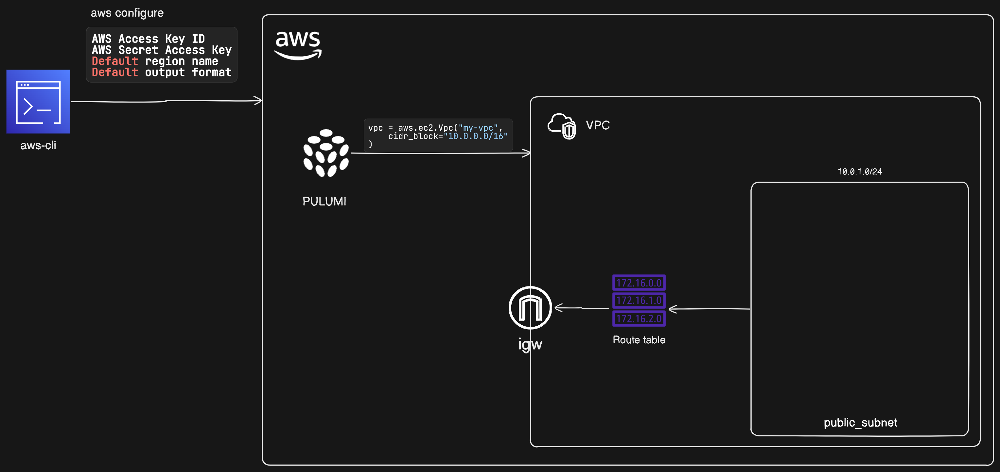

# Lab 1: VPC, Public Subnet, Public Route Table, IGW using JavaScript

## Introduction

In this lab, you will learn how to set up a basic network infrastructure on AWS using a Virtual Private Cloud (VPC) with Pulumi and JavaScript. Specifically, you will:

1. **Configure AWS CLI and Install Pulumi**: Set up the necessary tools to manage your AWS resources programmatically.
2. **Create a VPC**: A virtual network dedicated to your AWS account where you can launch AWS resources.
3. **Create a Public Subnet**: A subnet that can route traffic to and from the Internet via an Internet Gateway.
4. **Create an Internet Gateway (IGW)**: A gateway that allows instances in your VPC to communicate with the Internet.
5. **Create a Public Route Table**: A route table that routes traffic destined for the Internet to the Internet Gateway and associate it with the public subnet.

By the end of this lab, you will have a VPC with one public subnet that can communicate with the Internet. This setup forms the foundation for more complex network architectures and is essential for running public-facing applications on AWS. The implementation will be done using JavaScript.



### Step 1: Install and Configure AWS CLI

Follow the same instructions as before to install and configure AWS CLI:

1. **Install AWS CLI**:
   - Download and install the AWS CLI MSI Installer for Windows from [AWS CLI installation guide](https://docs.aws.amazon.com/cli/latest/userguide/getting-started-install.html).

2. **Configure AWS CLI**:
   - Open Command Prompt or PowerShell and run:
     ```sh
     aws configure
     ```
   - Enter your AWS Access Key ID, Secret Access Key, default region (`us-east-1`), and default output format (`json`).

### Step 2: Install Pulumi

1. **Install Pulumi CLI**:
   - Download and install the Pulumi CLI from [Pulumi Installation Guide](https://www.pulumi.com/docs/get-started/install/).

### Step 3: Set Up a Pulumi Project

1. **Set Up a Pulumi Project**:
   - Create a new directory for your project and navigate into it:
     ```sh
     mkdir my-vpc-project
     cd my-vpc-project
     ```

2. **Initialize a New Pulumi Project**:
   - Run the following command to create a new Pulumi project:
     ```sh
     pulumi new aws-javascript
     ```
   - Follow the prompts to set up your project.

### Step 4: Create the Pulumi Program

1. **Open `index.js`**:
   - Open the `index.js` file in your project directory.

2. **Create the VPC**:
   - Add the following code to create a VPC:
     ```javascript
     const pulumi = require("@pulumi/pulumi");
     const aws = require("@pulumi/aws");

     // Create a VPC
     const vpc = new aws.ec2.Vpc("my-vpc", {
         cidrBlock: "10.0.0.0/16",
     });

     exports.vpcId = vpc.id;
     ```

3. **Create the Public Subnet**:
   - Add the following code to create a public subnet:
     ```javascript
     // Create a public subnet
     const publicSubnet = new aws.ec2.Subnet("public-subnet", {
         vpcId: vpc.id,
         cidrBlock: "10.0.1.0/24",
         availabilityZone: "us-east-1a",
         mapPublicIpOnLaunch: true,
     });

     exports.publicSubnetId = publicSubnet.id;
     ```

4. **Create the Internet Gateway**:
   - Add the following code to create an Internet Gateway:
     ```javascript
     // Create an Internet Gateway
     const igw = new aws.ec2.InternetGateway("internet-gateway", {
         vpcId: vpc.id,
     });

     exports.igwId = igw.id;
     ```

5. **Create the Route Table and Associate with Public Subnet**:
   - Add the following code to create a route table, add a route to the IGW, and associate it with the public subnet:
     ```javascript
     // Create a route table
     const publicRouteTable = new aws.ec2.RouteTable("public-route-table", {
         vpcId: vpc.id,
     });

     // Create a route in the route table for the Internet Gateway
     const route = new aws.ec2.Route("igw-route", {
         routeTableId: publicRouteTable.id,
         destinationCidrBlock: "0.0.0.0/0",
         gatewayId: igw.id,
     });

     // Associate the route table with the public subnet
     const routeTableAssociation = new aws.ec2.RouteTableAssociation("public-route-table-association", {
         subnetId: publicSubnet.id,
         routeTableId: publicRouteTable.id,
     });

     exports.publicRouteTableId = publicRouteTable.id;
     ```

### Step 5: Deploy the Pulumi Stack

1. **Run Pulumi Up**:
   - Deploy the stack using:
     ```sh
     pulumi up
     ```
   - Review the changes and confirm by typing "yes".

### Step 6: Verify the Deployment

1. **Check the Outputs**:
   - After the deployment completes, you should see the exported VPC ID, public subnet ID, and route table ID in the output.

2. **Verify in AWS Management Console**:
   - Go to the [AWS Management Console](https://aws.amazon.com/console/) and navigate to the VPC, Subnet, and Internet Gateway sections to verify that the resources have been created as expected.

### Summary

By following these steps, you will have set up a VPC with one public subnet, a public route table, and an Internet Gateway using Pulumi and AWS CLI on Windows with JavaScript. If you encounter any issues or need further assistance, feel free to ask!