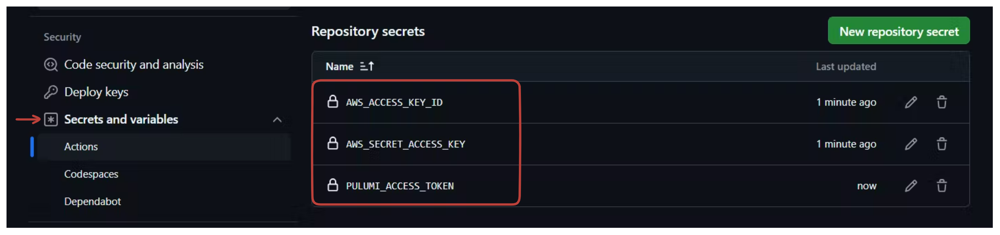
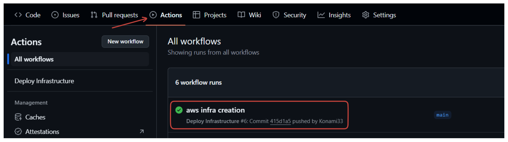
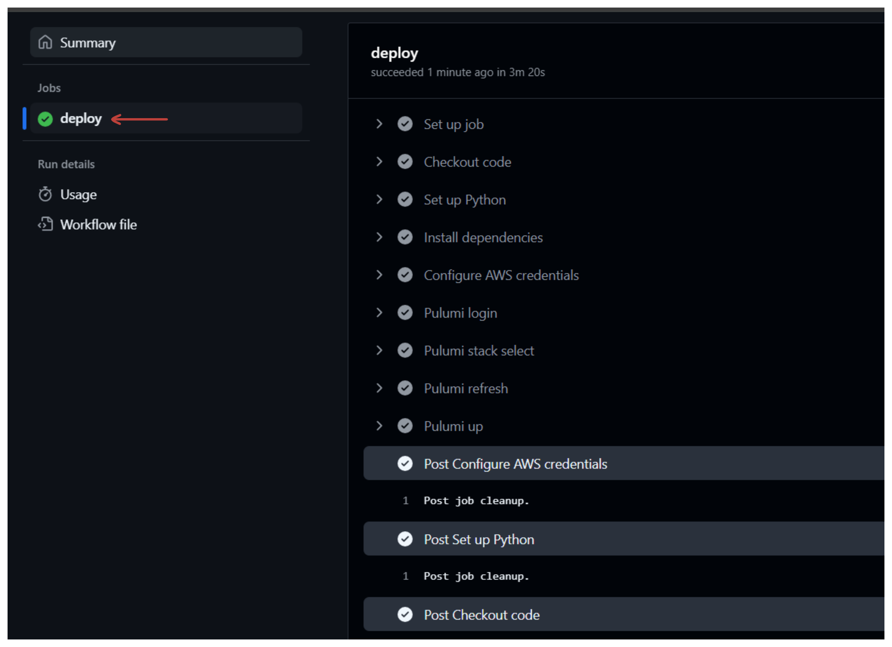
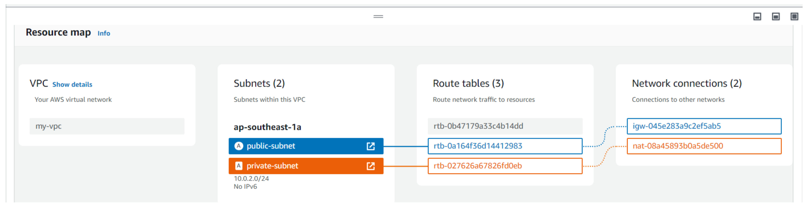
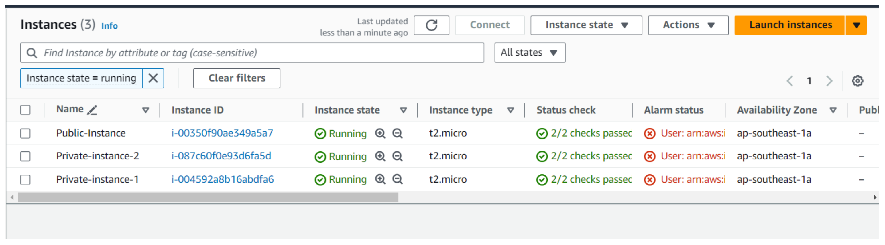
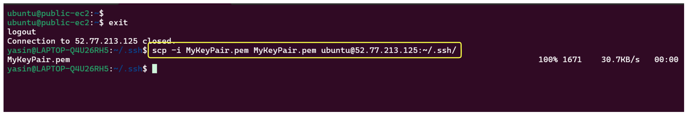
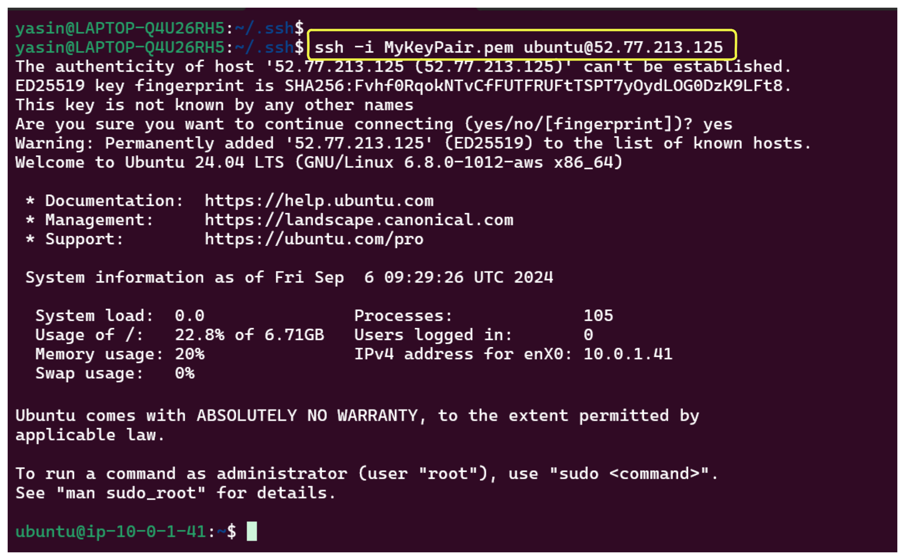
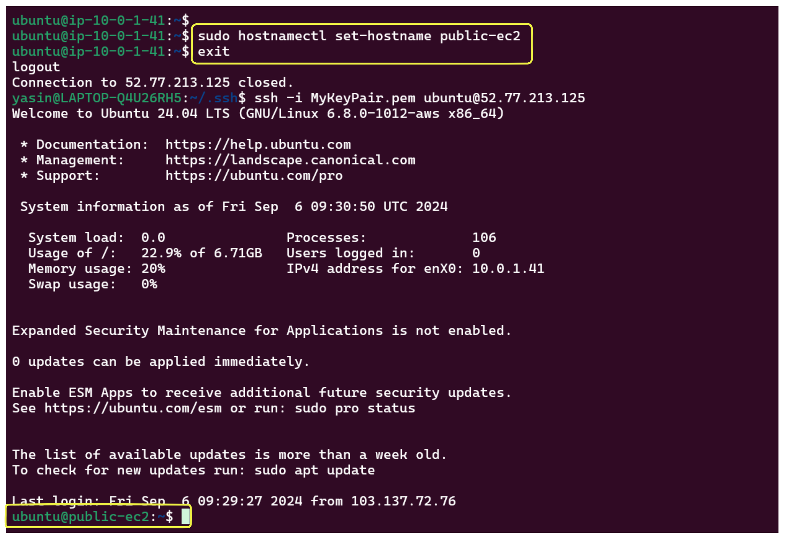
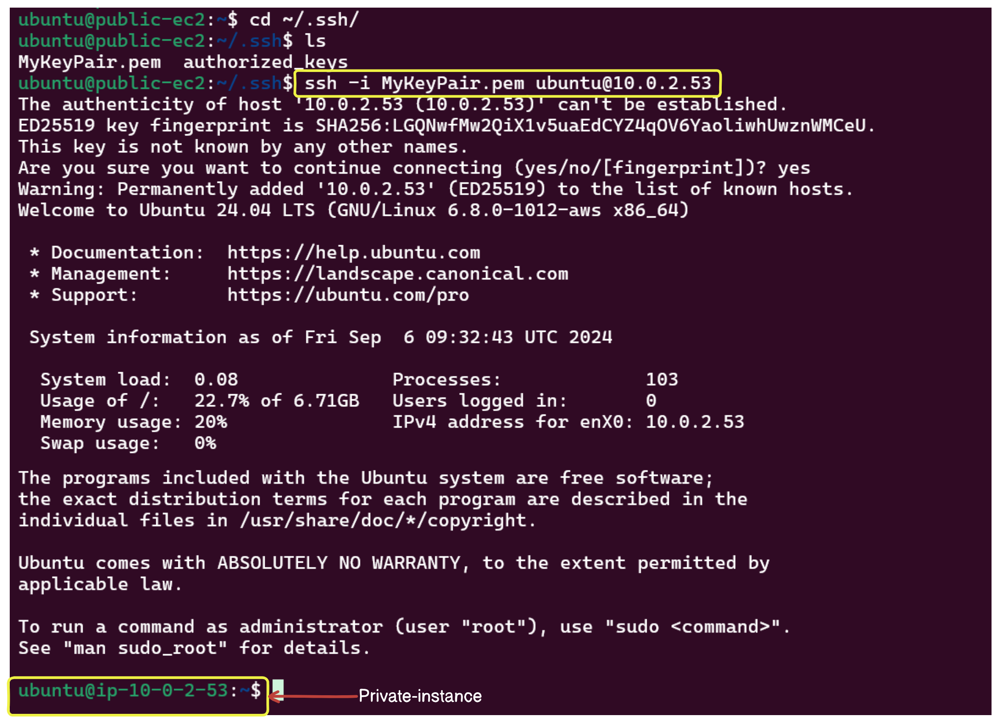
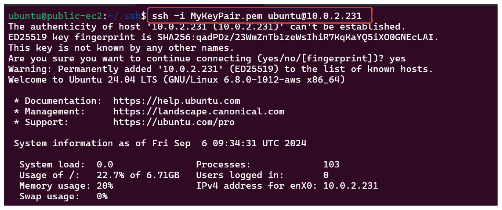

# Create AWS Infrastructure with GitHub Actions and SSH Access

In this lab, we will set up a Virtual Private Cloud (VPC) in AWS with both public and private subnets, launch EC2 instances in each subnet, and establish secure communication between these instances. Specifically, we will:

1. Configure Pulumi.
2. Set up a VPC with a public and a private subnet.
3. Create an Internet Gateway (IGW) for the public subnet.
4. Create a NAT Gateway for the private subnet.
5. Launch an EC2 instance in the public subnet with a public IP address.
6. Launch EC2 instances in the private subnet.
7. Attach Github action to create the resources using PULUMI. Basically Github action will trigger the pulumi to create the resouces.
8. Establish SSH access to the EC2 instances.


## Step by step

## Step 01: Set Up a Pulumi Project
- Create a new directory for your project and navigate into it:

  ```sh
  mkdir aws-infra
  cd aws-infra
  ```

- Install Python venv

  ```sh
  sudo apt update
  sudo apt install python3.8-venv
  ```
- Run the following command to create a new Pulumi project:

    ```sh
    pulumi new aws-python
    ```
    Follow the prompts to set up your project. It will create the necessary folders for pulumi setup.

- Create SSH Key-pair file

  ```sh
  aws ec2 create-key-pair --key-name MyKeyPair --query 'KeyMaterial' --output text > MyKeyPair.pem
  ```

- Set the permission of the key file

  ```sh
  chmod 400 MyKeyPair.pem
  ```

- Update the `__main__.py` file according to this:

  ```python
  import pulumi
  import pulumi_aws as aws

  # Create a VPC
  vpc = aws.ec2.Vpc("my-vpc",
      cidr_block="10.0.0.0/16",
      tags={
          "Name": "my-vpc"
      }
  )

  pulumi.export("vpc_id", vpc.id)

  # Create a public subnet
  public_subnet = aws.ec2.Subnet("public-subnet",
      vpc_id=vpc.id,
      cidr_block="10.0.1.0/24",
      availability_zone="ap-southeast-1a",
      map_public_ip_on_launch=True,
      tags={
          "Name": "public-subnet"
      }
  )

  pulumi.export("public_subnet_id", public_subnet.id)

  # Create a private subnet
  private_subnet = aws.ec2.Subnet("private-subnet",
      vpc_id=vpc.id,
      cidr_block="10.0.2.0/24",
      availability_zone="ap-southeast-1a",
      tags={
          "Name": "private-subnet"
      }
  )

  pulumi.export("private_subnet_id", private_subnet.id)

  # Create an Internet Gateway
  igw = aws.ec2.InternetGateway("internet-gateway",
      vpc_id=vpc.id
  )

  pulumi.export("igw_id", igw.id)

  # Create a route table for the public subnet
  public_route_table = aws.ec2.RouteTable("public-route-table",
      vpc_id=vpc.id
  )

  # Create a route in the route table for the Internet Gateway
  route = aws.ec2.Route("igw-route",
      route_table_id=public_route_table.id,
      destination_cidr_block="0.0.0.0/0",
      gateway_id=igw.id
  )

  # Associate the route table with the public subnet
  route_table_association = aws.ec2.RouteTableAssociation("public-route-table-association",
      subnet_id=public_subnet.id,
      route_table_id=public_route_table.id
  )

  pulumi.export("public_route_table_id", public_route_table.id)

  # Allocate an Elastic IP for the NAT Gateway
  eip = aws.ec2.Eip("nat-eip", vpc=True)

  # Create the NAT Gateway
  nat_gateway = aws.ec2.NatGateway("nat-gateway",
      subnet_id=public_subnet.id,
      allocation_id=eip.id
  )

  pulumi.export("nat_gateway_id", nat_gateway.id)

  # Create a route table for the private subnet
  private_route_table = aws.ec2.RouteTable("private-route-table",
      vpc_id=vpc.id
  )

  # Create a route in the route table for the NAT Gateway
  private_route = aws.ec2.Route("nat-route",
      route_table_id=private_route_table.id,
      destination_cidr_block="0.0.0.0/0",
      nat_gateway_id=nat_gateway.id
  )

  # Associate the route table with the private subnet
  private_route_table_association = aws.ec2.RouteTableAssociation("private-route-table-association",
      subnet_id=private_subnet.id,
      route_table_id=private_route_table.id
  )

  pulumi.export("private_route_table_id", private_route_table.id)

  # Create a security group for the public instance
  public_security_group = aws.ec2.SecurityGroup("public-secgrp",
      vpc_id=vpc.id,
      description='Enable HTTP and SSH access for public instance',
      ingress=[
          {'protocol': 'tcp', 'from_port': 80, 'to_port': 80, 'cidr_blocks': ['0.0.0.0/0']},
          {'protocol': 'tcp', 'from_port': 22, 'to_port': 22, 'cidr_blocks': ['0.0.0.0/0']}
      ],
      egress=[
          {'protocol': '-1', 'from_port': 0, 'to_port': 0, 'cidr_blocks': ['0.0.0.0/0']}
      ]
  )

  # Use a specific Ubuntu 20.04 LTS AMI
  ami_id = 'ami-01811d4912b4ccb26'

  # Create an EC2 instance in the public subnet
  public_instance = aws.ec2.Instance("public-instance",
      instance_type="t2.micro",
      vpc_security_group_ids=[public_security_group.id],
      ami=ami_id,
      subnet_id=public_subnet.id,
      key_name="MyKeyPair",
      associate_public_ip_address=True,
      tags={
          "Name": "Public-Instance"
      }
  )

  pulumi.export("public_instance_id", public_instance.id)
  pulumi.export("headnode-ip", public_instance.public_ip)

  # Create a security group for the private instance
  private_security_group = aws.ec2.SecurityGroup("private-secgrp",
      vpc_id=vpc.id,
      description='Enable SSH access for private instance',
      ingress=[
          {'protocol': 'tcp', 'from_port': 22, 'to_port': 22, 'cidr_blocks': ['0.0.0.0/0']}
      ],
      egress=[
          {'protocol': '-1', 'from_port': 0, 'to_port': 0, 'cidr_blocks': ['0.0.0.0/0']}
      ]
  )

  # Create two EC2 instances in the private subnet with unique resource names

  private_instance_1 = aws.ec2.Instance("private-instance-1",
      instance_type="t2.micro",
      vpc_security_group_ids=[private_security_group.id],
      ami=ami_id,
      subnet_id=private_subnet.id,
      key_name="MyKeyPair",
      tags={
          "Name": "Private-instance-1"
      }
  )
  pulumi.export("private_instance_1_id", private_instance_1.id)
  pulumi.export("private_instance_1_ip", private_instance_1.private_ip)


  private_instance_2 = aws.ec2.Instance("private-instance-2",
      instance_type="t2.micro",
      vpc_security_group_ids=[private_security_group.id],
      ami=ami_id,
      subnet_id=private_subnet.id,
      key_name="MyKeyPair",
      tags={
          "Name": "Private-instance-2"
      }
  )
  pulumi.export("private_instance_2_id", private_instance_2.id)
  pulumi.export("private_instance_2_ip", private_instance_2.private_ip)
  ```

## Step 02: Create GitHub Actions Workflow

- **Create a GitHub Actions workflow in this directory `.github/workflows/deploy.yml` of your project.**

```yaml
name: Deploy Infrastructure

on:
  push:
    branches:
      - main
    paths:
      - "PULUMI/PULUMI python/lab-5/infra/**" # Update your path

jobs:
  deploy:
    runs-on: ubuntu-latest

    steps:
      - name: Checkout code
        uses: actions/checkout@v3

      - name: Set up Python
        uses: actions/setup-python@v2
        with:
          python-version: '3.x'

      - name: Install dependencies
        run: |
          python -m venv venv
          source venv/bin/activate
          pip install pulumi pulumi-aws

      - name: Configure AWS credentials
        uses: aws-actions/configure-aws-credentials@v2
        with:
          aws-access-key-id: ${{ secrets.AWS_ACCESS_KEY_ID }}
          aws-secret-access-key: ${{ secrets.AWS_SECRET_ACCESS_KEY }}
          aws-region: ap-southeast-1

      - name: Pulumi login
        env:
          PULUMI_ACCESS_TOKEN: ${{ secrets.PULUMI_ACCESS_TOKEN }}
        run: pulumi login

      # select stack
      - name: Pulumi stack select
        run: pulumi stack select Konami33/AWS-INFRA-WITH-GITHUB-ACTION/dev
        working-directory: <Pulumi-project-directory-path> # Update this according to your pulumi project path

      # refresh
      - name: Pulumi refresh
        run: pulumi refresh --yes
        working-directory: <Pulumi-project-directory-path> # Update this according to your pulumi project path

      # up
      - name: Pulumi up
        run: pulumi up --yes
        working-directory: <Pulumi-project-directory-path> # Update this according to your pulumi project path
```

- **Create Github secret in your repository:**

  Go to **github_repository>settings>Secretes and Variables>Actions**. Create New repository secrets:

  - `AWS_ACCESS_KEY_ID` p -> AWS account access key id.
  - `AWS_SECRET_ACCESS_KEY` -> AWS account secret access key.
  - `PULUMI_ACCESS_TOKEN` -> Your pulumi access token.

  

- **Commit your changes and push to your GitHub repository.**

  ```sh
  git add .
  git commit -m "Add Pulumi infrastructure and workflow"
  git push origin main
  ```

## Step 03: Check github action workflow

- Go to your repository and check the **`Actions`** status:

  

- Check if the job is successful or not:

  


## Step 04: Check the AWS Resources

Go to your aws management console and you will see all the resouces

- Resouce Map:

  

- Instances:

  


## Step 05: SSH connectivity

In our architecture we have a public instance and private instances. To connect to these instances, we need to first copy the key file to public instance, SSH into our public instance and then from there, we can SSH into the private instances.

- **First copy the key file into to the public instance `~.ssh/` directory:**

  ```sh
  scp -i MyKeyPair.pem MyKeyPair.pem ubuntu@public-instance-ip:~/.ssh/
  ```
  

- **Now SSH into the public instance**

  ```sh
  ssh -i <path-to-your-keyfile>/MyKeyPair.pem ubuntu@public-instance-ip
  ```

  

- **You can also set the hostname:(optional)**

  ```sh
  sudo hostnamectl set-hostname public-ec2
  ```
  
- **Then SSH into the private instances from the public instance:**

  ```sh
  ssh -i MyKeyPair.pem ubuntu@private-instance1-ip
  ```
  

  ```sh
  ssh -i MyKeyPair.pem ubuntu@private-instance2-ip
  ```
  

### Conclusion

So, we have setup pulumi project, created github action to automatically create the aws resources using pulumi. Then we have also SSH into the instances.