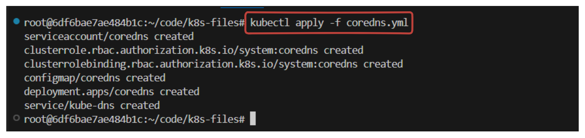
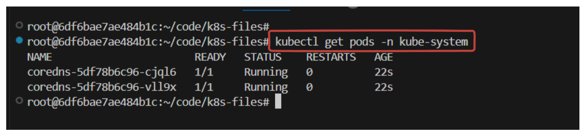
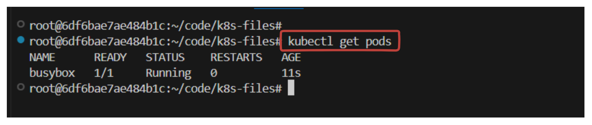

# Deploying the DNS Cluster Add-on

In this lab you will deploy the [DNS add-on](https://kubernetes.io/docs/concepts/services-networking/dns-pod-service/) which provides DNS based service discovery, backed by [CoreDNS](https://coredns.io/), to applications running inside the Kubernetes cluster.

## The DNS Cluster Add-on

Deploy the `coredns` cluster add-on:

```yaml
apiVersion: v1
kind: ServiceAccount
metadata:
  name: coredns
  namespace: kube-system
---
apiVersion: rbac.authorization.k8s.io/v1
kind: ClusterRole
metadata:
  labels:
    kubernetes.io/bootstrapping: rbac-defaults
  name: system:coredns
rules:
- apiGroups:
  - ""
  resources:
  - endpoints
  - services
  - pods
  - namespaces
  verbs:
  - list
  - watch
- apiGroups:
  - ""
  resources:
  - nodes
  verbs:
  - get
- apiGroups: 
  - discovery.k8s.io
  resources:
  - endpointslices
  verbs:
  - list
  - watch
---
apiVersion: rbac.authorization.k8s.io/v1
kind: ClusterRoleBinding
metadata:
  annotations:
    rbac.authorization.kubernetes.io/autoupdate: "true"
  labels:
    kubernetes.io/bootstrapping: rbac-defaults
  name: system:coredns
roleRef:
  apiGroup: rbac.authorization.k8s.io
  kind: ClusterRole
  name: system:coredns
subjects:
- kind: ServiceAccount
  name: coredns
  namespace: kube-system
---
apiVersion: v1
kind: ConfigMap
metadata:
  name: coredns
  namespace: kube-system
data:
  Corefile: |
    .:53 {
        errors
        health
        ready
        kubernetes cluster.local in-addr.arpa ip6.arpa {
          pods insecure
          fallthrough in-addr.arpa ip6.arpa
        }
        prometheus :9153
        forward . /etc/resolv.conf
        cache 30
        loop
        reload
        loadbalance
    }
---
apiVersion: apps/v1
kind: Deployment
metadata:
  name: coredns
  namespace: kube-system
  labels:
    k8s-app: kube-dns
    kubernetes.io/name: "CoreDNS"
spec:
  replicas: 2
  strategy:
    type: RollingUpdate
    rollingUpdate:
      maxUnavailable: 1
  selector:
    matchLabels:
      k8s-app: kube-dns
  template:
    metadata:
      labels:
        k8s-app: kube-dns
      annotations:
        container.apparmor.security.beta.kubernetes.io/coredns: unconfined
    spec:
      priorityClassName: system-cluster-critical
      serviceAccountName: coredns
      tolerations:
        - key: "CriticalAddonsOnly"
          operator: "Exists"
      nodeSelector:
        beta.kubernetes.io/os: linux
      containers:
      - name: coredns
        image: coredns/coredns:1.7.0
        imagePullPolicy: IfNotPresent
        resources:
          limits:
            memory: 170Mi
          requests:
            cpu: 100m
            memory: 70Mi
        args: [ "-conf", "/etc/coredns/Corefile" ]
        volumeMounts:
        - name: config-volume
          mountPath: /etc/coredns
          readOnly: true
        ports:
        - containerPort: 53
          name: dns
          protocol: UDP
        - containerPort: 53
          name: dns-tcp
          protocol: TCP
        - containerPort: 9153
          name: metrics
          protocol: TCP
        securityContext:
          allowPrivilegeEscalation: false
          capabilities:
            add:
            - NET_BIND_SERVICE
            drop:
            - all
          readOnlyRootFilesystem: true
        livenessProbe:
          httpGet:
            path: /health
            port: 8080
            scheme: HTTP
          initialDelaySeconds: 60
          timeoutSeconds: 5
          successThreshold: 1
          failureThreshold: 5
        readinessProbe:
          httpGet:
            path: /ready
            port: 8181
            scheme: HTTP
      dnsPolicy: Default
      volumes:
        - name: config-volume
          configMap:
            name: coredns
            items:
            - key: Corefile
              path: Corefile
---
apiVersion: v1
kind: Service
metadata:
  name: kube-dns
  namespace: kube-system
  annotations:
    prometheus.io/port: "9153"
    prometheus.io/scrape: "true"
  labels:
    k8s-app: kube-dns
    kubernetes.io/cluster-service: "true"
    kubernetes.io/name: "CoreDNS"
spec:
  selector:
    k8s-app: kube-dns
  clusterIP: 10.32.0.10
  ports:
  - name: dns
    port: 53
    protocol: UDP
  - name: dns-tcp
    port: 53
    protocol: TCP
  - name: metrics
    port: 9153
    protocol: TCP
```

Apply the manifest file:

```sh
kubectl apply -f coredns.yml
```

> output



List the pods created by the `core-dns` deployment:

```sh
kubectl get pods -l k8s-app=kube-dns -n kube-system
```

> output



## Verification

Create a `busybox` deployment: `busybox-pod.yaml`

```yaml
apiVersion: v1
kind: Pod
metadata:
  name: busybox
  annotations:
    container.apparmor.security.beta.kubernetes.io/busybox: unconfined
spec:
  containers:
  - name: busybox
    image: busybox:1.28
    command: ["sleep", "3600"]
```

```sh
kubectl apply -f busybox-pod.yaml
```

> Make sure to add this block in the metadata section:

```sh
annotations:
  container.apparmor.security.beta.kubernetes.io/busybox: unconfined
```

> Output



<!-- Retrieve the full name of the `busybox` pod:

```sh
POD_NAME=$(kubectl get pods -l run=busybox -o jsonpath="{.items[0].metadata.name}")
```

Execute a DNS lookup for the `kubernetes` service inside the `busybox` pod:

```sh
kubectl exec -ti $POD_NAME -- nslookup kubernetes
```

> output

```sh
Server:    10.32.0.10
Address 1: 10.32.0.10 kube-dns.kube-system.svc.cluster.local

Name:      kubernetes
Address 1: 10.32.0.1 kubernetes.default.svc.cluster.local
```
--->


